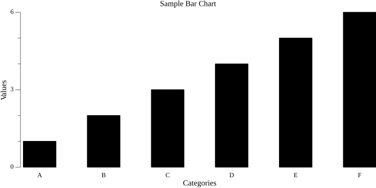

# [ gplot ] Package

## Overview

The `gplot` package is designed to create and save various types of charts using the Gonum library. It provides a simple interface to generate and export charts in different formats such as PNG, PDF, JPEG, and SVG.

## Installation

To install the `gplot` package, use the following command:

```bash
go get github.com/HazelnutParadise/insyra/gplot
```

## Features

### Bar Chart

#### `BarChartConfig`

- `Title`: The title of the chart.
- `Subtitle`: The subtitle of the chart.
- `XAxis`: Data for the X-axis (categories).
- `SeriesData`: The data for the series. Supported types:
  - `[]float64`
  - `*insyra.DataList`
- `XAxisName`: Optional: Name for the X-axis.
- `YAxisName`: Optional: Name for the Y-axis.
- `BarWidth`: Optional: Width of each bar in the chart. Default is 20.

#### Example



### Saving Charts

`func SaveChart(plt *plot.Plot, filename string)`

Saves the plot to a file. Supported file formats: `.jpg`, `.jpeg`, `.pdf`, `.png`, `.svg`, `.tex`, `.tif`, `.tiff`
Automatically determine the file extension based on the filename.