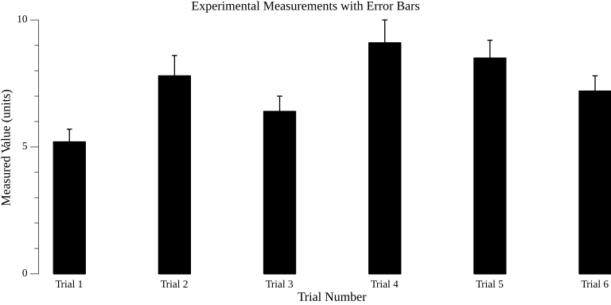
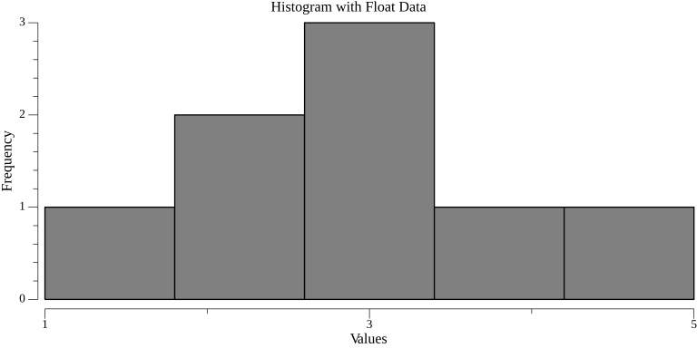
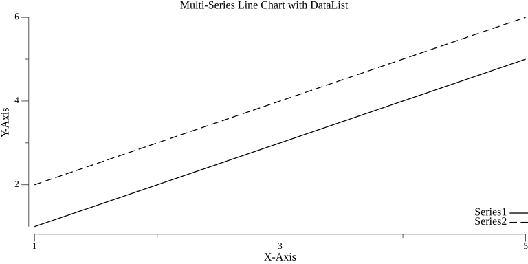
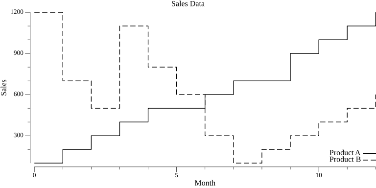
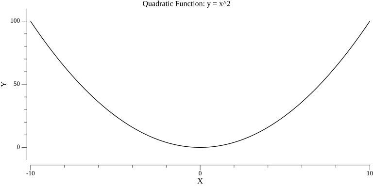
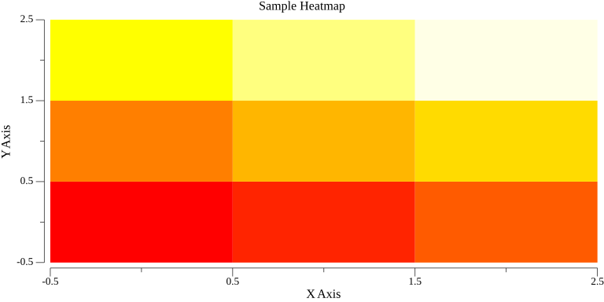

# [ gplot ] Package

The `gplot` package creates static charts using the Gonum plotting library. It's ideal for generating publication-quality charts that can be saved as PNG, PDF, SVG, or other image formats.

## Installation

```bash
go get github.com/HazelnutParadise/insyra/gplot
```

## Quick Start

```go
package main

import "github.com/HazelnutParadise/insyra/gplot"

func main() {
    // Create a simple bar chart
    config := gplot.BarChartConfig{
        Title: "Monthly Sales",
        XAxis: []string{"Jan", "Feb", "Mar", "Apr"},
    }
    data := []float64{100, 150, 120, 180}
    plt := gplot.CreateBarChart(config, data)
    gplot.SaveChart(plt, "sales.png")
}
```

## Supported Chart Types

| Chart Type | Function | Use Case |
| ---------- | -------- | -------- |
| Bar Chart | `CreateBarChart` | Comparing categories |
| Histogram | `CreateHistogram` | Distribution analysis |
| Line Chart | `CreateLineChart` | Trends over time |
| Scatter Plot | `CreateScatterPlot` | Correlation analysis |
| Step Chart | `CreateStepChart` | Discrete changes |
| Function Plot | `CreateFunctionPlot` | Mathematical functions |
| Heatmap | `CreateHeatmapChart` | Matrix visualization |

## Saving Charts

```go
func SaveChart(plt *plot.Plot, filename string)
```

**Description:** Saves the chart to a file. The format is determined by the file extension.

**Parameters:**

- `plt`: Input value for `plt`. Type: `*plot.Plot`.
- `filename`: File path to use. Type: `string`.

**Returns:**

- None.

**Supported formats:** `.png`, `.jpg`, `.jpeg`, `.pdf`, `.svg`, `.tex`, `.tif`, `.tiff`

```go
gplot.SaveChart(plt, "chart.png")  // PNG format
gplot.SaveChart(plt, "chart.pdf")  // PDF format
gplot.SaveChart(plt, "chart.svg")  // SVG format
```

## Chart Types

### Bar Chart

Creates a bar chart for comparing values across categories.

```go
type BarChartConfig struct {
    Title     string    // Chart title
    XAxis     []string  // Category labels
    XAxisName string    // Optional: X-axis label
    YAxisName string    // Optional: Y-axis label
    BarWidth  float64   // Optional: Bar width (default: 20)
    ErrorBars []float64 // Optional: Error bar values (if provided, must match data length)
}
```

**Example:**

```go
config := gplot.BarChartConfig{
    Title:     "Quarterly Revenue",
    XAxis:     []string{"Q1", "Q2", "Q3", "Q4"},
    XAxisName: "Quarter",
    YAxisName: "Revenue ($K)",
    BarWidth:  25,
}
data := []float64{250, 300, 280, 350}
plt := gplot.CreateBarChart(config, data)
gplot.SaveChart(plt, "revenue.png")
```


**With Error Bars:**

```go
config := gplot.BarChartConfig{
    Title:     "Experimental Results",
    XAxis:     []string{"A", "B", "C", "D"},
    ErrorBars: []float64{0.5, 0.8, 0.6, 0.9},
}
data := []float64{5.2, 7.8, 6.4, 9.1}
plt := gplot.CreateBarChart(config, data)
gplot.SaveChart(plt, "experiment.png")
```



### Histogram

Creates a histogram to visualize data distribution.

```go
type HistogramConfig struct {
    Title     string // Chart title
    XAxisName string // Optional: X-axis label
    YAxisName string // Optional: Y-axis label
    Bins      int    // Number of bins
}
```

**Example:**

```go
import "math/rand"

// Generate sample data
data := make([]float64, 1000)
for i := range data {
    data[i] = rand.NormFloat64()*15 + 100 // Normal distribution
}

config := gplot.HistogramConfig{
    Title:     "Score Distribution",
    XAxisName: "Score",
    YAxisName: "Frequency",
    Bins:      20,
}
plt := gplot.CreateHistogram(config, data)
gplot.SaveChart(plt, "distribution.png")
```



### Line Chart

Creates a line chart for visualizing trends.

```go
type LineChartConfig struct {
    Title     string    // Chart title
    XAxis     []float64 // X-axis data
    XAxisName string    // Optional: X-axis label
    YAxisName string    // Optional: Y-axis label
}
```

**Example:**

```go
config := gplot.LineChartConfig{
    Title:     "Temperature Trends",
    XAxisName: "Day",
    YAxisName: "Temperature (C)",
}
data := map[string][]float64{
    "City A": {22, 24, 23, 25, 26},
    "City B": {18, 19, 20, 21, 22},
}
plt := gplot.CreateLineChart(config, data)
gplot.SaveChart(plt, "temperature.png")
```



### Scatter Plot

Creates a scatter plot for correlation analysis.

```go
type ScatterPlotConfig struct {
    Title     string // Chart title
    XAxisName string // Optional: X-axis label
    YAxisName string // Optional: Y-axis label
}
```

**Data format:** For `map[string][][]float64`, each series is a slice of `[x, y]` coordinate pairs.

**Example:**

```go
config := gplot.ScatterPlotConfig{
    Title: "Height vs Weight",
    XAxisName: "Height (cm)",
    YAxisName: "Weight (kg)",
}
data := map[string][][]float64{
    "Male": {
        {170, 70}, {175, 75}, {180, 80}, {168, 68}, {185, 85},
    },
    "Female": {
        {160, 55}, {165, 60}, {158, 52}, {170, 65}, {163, 58},
    },
}
plt := gplot.CreateScatterPlot(config, data)
gplot.SaveChart(plt, "height_weight.png")
```

### Step Chart

Creates a step chart for data that changes at discrete intervals.

```go
type StepChartConfig struct {
    Title     string    // Chart title
    XAxis     []float64 // X-axis data
    XAxisName string    // Optional: X-axis label
    YAxisName string    // Optional: Y-axis label
    StepStyle string    // Optional: "pre", "mid", or "post" (default: "post")
}
```

**Step Styles:**

- `"pre"`: Step before the point (vertical then horizontal)
- `"mid"`: Step at midpoint
- `"post"`: Step after the point (horizontal then vertical)

**Example:**

```go
config := gplot.StepChartConfig{
    Title: "Stock Price Changes",
    XAxis: []float64{9, 10, 11, 12, 13}, // numeric X values
    XAxisName: "Time",
    YAxisName: "Price ($)",
    StepStyle: "post",
}
data := map[string][]float64{
    "Stock A": {100, 102, 101, 105, 103},
}
plt := gplot.CreateStepChart(config, data)
gplot.SaveChart(plt, "stock.png")
```



### Function Plot

Plots mathematical functions.

```go
type FunctionPlotConfig struct {
    Title     string  // Chart title
    XAxisName string  // X-axis label
    YAxisName string  // Y-axis label
    XMin      float64 // Optional: Minimum X value
    XMax      float64 // Optional: Maximum X value
    YMin      float64 // Optional: Minimum Y value
    YMax      float64 // Optional: Maximum Y value
}
```

**Example:**

```go
import "math"

config := gplot.FunctionPlotConfig{
    Title: "Sine Wave",
    XAxisName: "x",
    YAxisName: "sin(x)",
    XMin:  -2 * math.Pi,
    XMax:  2 * math.Pi,
}
plt := gplot.CreateFunctionPlot(config, math.Sin)
gplot.SaveChart(plt, "sine.png")

// Custom function
config2 := gplot.FunctionPlotConfig{
    Title: "Quadratic Function",
    XAxis: "x",
    YAxis: "y",
    Func: func(x float64) float64 {
        return x*x - 4*x + 3
    },
    XMin: -2,
    XMax: 6,
}
plt2 := gplot.CreateFunctionPlot(config2)
gplot.SaveChart(plt2, "quadratic.png")
```



### Heatmap

Creates a heatmap for matrix visualization.

```go
type HeatmapChartConfig struct {
    Title     string    // Chart title
    XAxis     []float64 // Optional: X-axis coordinates
    YAxis     []float64 // Optional: Y-axis coordinates
    XAxisName string    // Optional: X-axis label
    YAxisName string    // Optional: Y-axis label
    Colors    int       // Optional: Number of colors (default: 20)
    Alpha     float64   // Optional: Transparency (default: 1.0)
}
```

**Example:**

```go
// Create correlation matrix data
data := [][]float64{
    {1.0, 0.8, 0.3},
    {0.8, 1.0, 0.5},
    {0.3, 0.5, 1.0},
}

config := gplot.HeatmapChartConfig{
    Title:  "Correlation Matrix",
    XAxis:  []float64{0, 1, 2},
    YAxis:  []float64{0, 1, 2},
    Colors: 20,
}
plt := gplot.CreateHeatmapChart(config, data)
gplot.SaveChart(plt, "correlation.png")
```



## Using with DataList and DataTable

All chart types support Insyra data structures:

```go
import (
    "github.com/HazelnutParadise/insyra"
    "github.com/HazelnutParadise/insyra/gplot"
)

// Using DataList for bar chart
dl := insyra.NewDataList(100, 150, 120, 180)
config := gplot.BarChartConfig{
    Title: "Sales Data",
    XAxis: []string{"Q1", "Q2", "Q3", "Q4"},
}
plt := gplot.CreateBarChart(config, dl)

// Using DataTable for heatmap
dt := insyra.NewDataTable(
    insyra.NewDataList(1.0, 0.8, 0.3),
    insyra.NewDataList(0.8, 1.0, 0.5),
    insyra.NewDataList(0.3, 0.5, 1.0),
)
heatConfig := gplot.HeatmapChartConfig{
    Title: "Correlation Matrix",
}
plt2 := gplot.CreateHeatmapChart(heatConfig, dt)
```

## Tips

- Use meaningful titles and axis labels for better readability
- Choose appropriate bin counts for histograms (typically 10-30)
- For publication, prefer SVG formats for vector graphics
- Error bars should have the same length as the data
