# [ plot ] Package

The `plot` package creates interactive web-based charts using [go-echarts](https://github.com/go-echarts/go-echarts). Charts can be saved as HTML files for web viewing or exported as PNG images.

**PNG export notes:**

- `SavePNG` renders via Chrome/Chromium when available.
- If local rendering fails and `useOnlineServiceOnFail` is `true` (default), it sends the chart to HazelnutParadise's online renderer.
- Disable the online fallback by passing `false` to `SavePNG`.

## Installation

```bash
go get github.com/HazelnutParadise/insyra/plot
```

## Quick Start

```go
package main

import (
    "github.com/HazelnutParadise/insyra"
    "github.com/HazelnutParadise/insyra/plot"
)

func main() {
    // Create data
    sales := insyra.NewDataList(100, 150, 120, 180).SetName("Sales")

    // Create chart configuration
    config := plot.BarChartConfig{
        Title: "Monthly Sales",
        XAxis: []string{"Jan", "Feb", "Mar", "Apr"},
    }

    // Create and save chart
    chart := plot.CreateBarChart(config, sales)
    plot.SaveHTML(chart, "sales.html")

    // Or save as PNG (requires Chrome/Chromium)
    plot.SavePNG(chart, "sales.png")
}
```

## Supported Chart Types

| Chart      | Function                | Use Case                     |
| ---------- | ----------------------- | ---------------------------- |
| Bar        | `CreateBarChart`        | Category comparison          |
| Line       | `CreateLineChart`       | Trends over time             |
| Scatter    | `CreateScatterChart`    | Correlation analysis         |
| Pie        | `CreatePieChart`        | Part-to-whole relationships  |
| HeatMap    | `CreateHeatMap`         | Matrix visualization         |
| Radar      | `CreateRadarChart`      | Multi-dimensional comparison |
| Funnel     | `CreateFunnelChart`     | Stage-based processes        |
| Gauge      | `CreateGaugeChart`      | Single value display         |
| WordCloud  | `CreateWordCloud`       | Text frequency               |
| Sankey     | `CreateSankeyChart`     | Flow visualization           |
| BoxPlot    | `CreateBoxPlot`         | Distribution comparison      |
| K-Line     | `CreateKlineChart`      | Stock data                   |
| ThemeRiver | `CreateThemeRiverChart` | Temporal flow data           |

## Common Types

### Theme

The `Theme` type defines the visual style of the chart.

```go
type Theme string

const (
    ThemeChalk         Theme = "chalk"
    ThemeEssos         Theme = "essos"
    ThemeInfographic   Theme = "infographic"
    ThemeMacarons      Theme = "macarons"
    ThemePurplePassion Theme = "purple-passion"
    ThemeRoma          Theme = "roma"
    ThemeRomantic      Theme = "romantic"
    ThemeShine         Theme = "shine"
    ThemeVintage       Theme = "vintage"
    ThemeWalden        Theme = "walden"
    ThemeWesteros      Theme = "westeros"
    ThemeWonderland    Theme = "wonderland"
)
```

### Position

Used for positioning elements like titles and legends.

```go
type Position string

const (
    PositionTop    Position = "top"
    PositionBottom Position = "bottom"
    PositionLeft   Position = "left"
    PositionRight  Position = "right"
)
```

### LabelPosition

Used for positioning labels on chart elements.

```go
type LabelPosition string

const (
    LabelPositionTop               LabelPosition = "top"
    LabelPositionBottom            LabelPosition = "bottom"
    LabelPositionLeft              LabelPosition = "left"
    LabelPositionRight             LabelPosition = "right"
    LabelPositionInside            LabelPosition = "inside"
    LabelPositionInsideLeft        LabelPosition = "insideLeft"
    LabelPositionInsideRight       LabelPosition = "insideRight"
    LabelPositionInsideTop         LabelPosition = "insideTop"
    LabelPositionInsideBottom      LabelPosition = "insideBottom"
    LabelPositionInsideTopLeft     LabelPosition = "insideTopLeft"
    LabelPositionInsideBottomLeft  LabelPosition = "insideBottomLeft"
    LabelPositionInsideTopRight    LabelPosition = "insideTopRight"
    LabelPositionInsideBottomRight LabelPosition = "insideBottomRight"
)
```

## Things to be careful about

### A failed chart is `nil`, and saving a `nil` chart crashes

No `Create...` function in this package returns an `error`. Twelve of the
thirteen return `nil` and log the reason through `insyra.LogWarning` when they
cannot build a chart — usually because the data is missing, or (for
`CreateHeatMap`) because calendar mode was asked for without `time.Time` X
values and a `CalendarOpts`. `CreateGaugeChart` takes a plain `float64` and has
no such path, so it always returns a chart.

The `nil` is worth checking for. A `nil` `*charts.Bar` still satisfies the
`Renderable` interface, so `SaveHTML` and `SavePNG` accept it and then
dereference it: passing one straight through panics with a nil pointer
dereference rather than returning an error. Check the result before you save.

```go
chart := plot.CreateBarChart(config, data)
if chart == nil {
    // CreateBarChart already logged why
    return
}
plot.SaveHTML(chart, "sales.html")
```

### A `nil` list among real lists is skipped, not fatal

`CreateBarChart`, `CreateLineChart` and `CreateBoxPlot` read their data as
`insyra.IDataList`, and every list goes through `AtomicDo`, which a nil
dereferences. Rather than panic, a nil entry — either a nil interface or a nil
`*insyra.DataList` inside one — is dropped with a warning naming its index, and
the remaining lists are drawn. Only when nothing usable is left does the
constructor return `nil`. For `CreateBoxPlot` a series whose lists were all nil
is dropped as a whole, while a series with no lists to begin with is kept.
`CreateWordCloud` takes a single list and has nothing to skip, so a nil there
goes straight to a warning and a `nil` return.

### `Title` and `Subtitle` are HTML-escaped

go-echarts embeds the chart options inside a `<script>` block without HTML
escaping, so text taken from user data could otherwise close the script and
inject markup. Every one of the thirteen constructors passes `Title` and
`Subtitle` through `html.EscapeString` before they reach that block, and the
canvas still renders the text. A title of `</script><script>alert(1)</script>`
is written to the file as `&lt;/script&gt;&lt;script&gt;alert(1)&lt;/script&gt;`.
This covers those two fields only; axis names, series names and data values go
into the options as given.

### Some constructors write back into what you passed in

Three of them do, in different ways, so it is worth knowing before you reuse a
slice or a map across calls:

- `CreateKlineChart` sorts the `KlinePoint` slice **in place** by date. Passing
  `points...` reorders your own slice.
- `CreateRadarChart` fills in `Color` on each element of the `series` slice you
  pass, and adds a key to `config.MaxValues` for every indicator that has no
  entry yet. The map is only touched if you supplied one; a `nil` `MaxValues`
  is replaced only inside the function, so your config still reads as `nil`
  afterwards.
- `CreateBoxPlot` also assigns default colours, but the caller does not see it:
  it copies each series into a fresh slice while dropping nil lists, and the
  colour pass writes into that copy.

---

## Saving Charts

### Save HTML

```go
func SaveHTML(chart Renderable, path string, animation ...bool) error
```

**Description:** Renders the chart to an HTML file.

**Parameters:**

- `chart`: The chart object. Type: `Renderable`.
- `path`: The file path to save the HTML. Type: `string`.
- `animation`: Optional boolean to enable/disable animation (default: enabled).

**Returns:**

- `error`: Error when the operation fails.

**Note:** the generated HTML is not reproducible across runs. go-echarts gives
each chart object a random id — an 11-character string such as `ZNEYhPGqrFjX` —
and writes it into the `id` attribute of the chart's `<div>` and into the names
of the generated `goecharts_...` and `option_...` variables. Two charts built
from the same config therefore produce two different files even though the
option JSON is identical. Rendering the *same* chart object twice is stable,
because the id is assigned when the chart is created, not when it is saved. So
compare saved files by substring, or mask the id first, rather than with a
byte-for-byte `==` across runs.

### Save PNG

```go
func SavePNG(chart Renderable, pngPath string, useOnlineServiceOnFail ...bool) error
```

**Description:** Renders the chart to a PNG image. Requires Chrome/Chromium installed or uses an online fallback service.

**Parameters:**

- `chart`: The chart object. Type: `Renderable`.
- `pngPath`: The file path to save the PNG. Type: `string`. It must carry a file extension — that is what chooses the image format — and `SavePNG` returns an error when it does not.
- `useOnlineServiceOnFail`: Optional boolean. If true (default), it tries to use an online rendering service if local rendering fails.

**Returns:**

- `error`: Error when the operation fails.

---

## Chart Types

### 1. Bar Chart

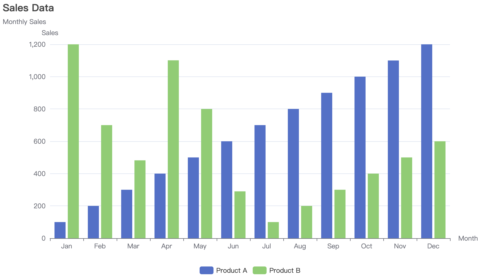

#### Configuration

```go
type BarChartConfig struct {
    Width           string   // Default "900px"
    Height          string   // Default "500px"
    BackgroundColor string   // Default "white"
    Theme           Theme
    Title           string
    Subtitle        string
    TitlePos        Position
    HideLegend      bool
    LegendPos       Position

    XAxis     []string // X-axis labels
    XAxisName string
    YAxisName string

    // Y-axis customization
    YAxisMin         *float64
    YAxisMax         *float64
    YAxisSplitNumber *int
    YAxisFormatter   string   // e.g. "{value}°C"

    Colors     []string
    ShowLabels bool
    LabelPos   LabelPosition
}
```

#### Creation

```go
func CreateBarChart(config BarChartConfig, data ...insyra.IDataList) *charts.Bar
```

**Description:** Use when you need this function.

**Parameters:**

- `config`: Configuration options. Type: `BarChartConfig`.
- `data`: Variadic `insyra.IDataList` values.

**Returns:**

- `*charts.Bar`: Return value.

### 2. Line Chart

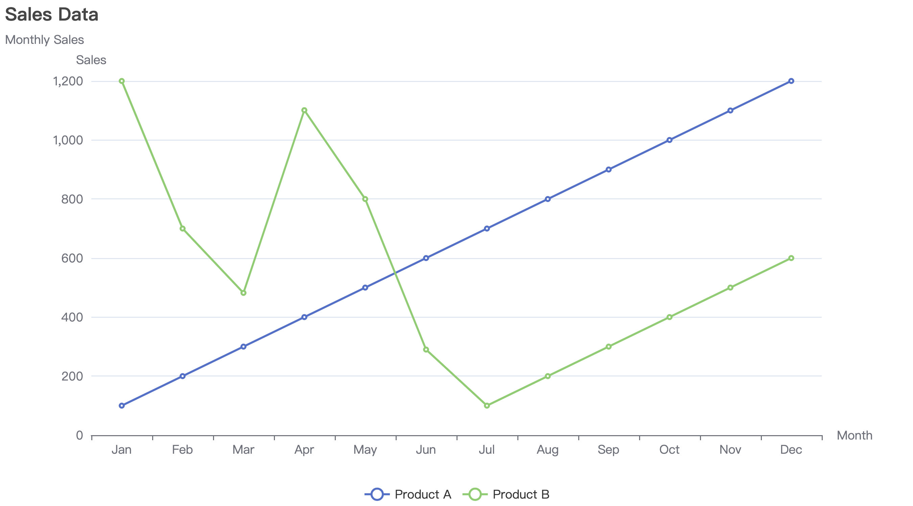

#### Configuration

```go
type LineChartConfig struct {
    Width           string
    Height          string
    BackgroundColor string
    Theme           Theme
    Title           string
    Subtitle        string
    TitlePos        Position
    HideLegend      bool
    LegendPos       Position

    XAxis     []string
    XAxisName string

    YAxisName        string
    YAxis            []string // Category labels for Y-axis
    YAxisMin         *float64
    YAxisMax         *float64
    YAxisSplitNumber *int
    YAxisFormatter   string

    Colors     []string
    ShowLabels bool
    LabelPos   string // "top", "bottom", "left", "right"
    Smooth     bool   // Smooth lines
    FillArea   bool   // Fill area under lines
}
```

#### Creation

```go
func CreateLineChart(config LineChartConfig, data ...insyra.IDataList) *charts.Line
```

**Description:** Use when you need this function.

**Parameters:**

- `config`: Configuration options. Type: `LineChartConfig`.
- `data`: Variadic `insyra.IDataList` values.

**Returns:**

- `*charts.Line`: Return value.

### 3. Scatter Chart

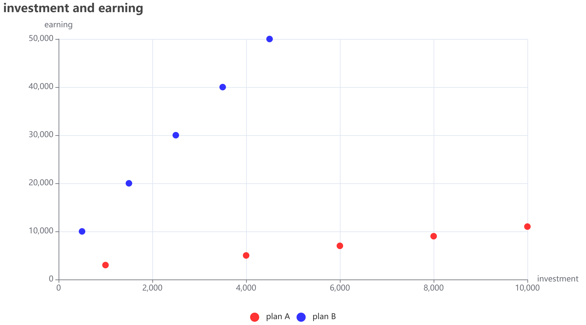

#### Configuration

```go
type ScatterPoint struct {
    X float64
    Y float64
}

type ScatterChartConfig struct {
    Width           string
    Height          string
    BackgroundColor string
    Theme           Theme
    Title           string
    Subtitle        string
    TitlePos        Position
    HideLegend      bool
    LegendPos       Position

    XAxisName        string
    XAxisMin         *float64
    XAxisMax         *float64
    XAxisSplitNumber *int
    XAxisFormatter   string

    YAxisName        string
    YAxisMin         *float64
    YAxisMax         *float64
    YAxisSplitNumber *int
    YAxisFormatter   string

    Colors     []string
    ShowLabels bool
    LabelPos   LabelPosition
    SplitLine  bool
    Symbol     []string // e.g. "circle", "rect"
    SymbolSize int
}
```

#### Creation

```go
func CreateScatterChart(config ScatterChartConfig, data map[string][]ScatterPoint) *charts.Scatter
```

**Description:** Use when you need this function.

**Parameters:**

- `config`: Configuration options. Type: `ScatterChartConfig`.
- `data`: Input data values. Type: `map[string][]ScatterPoint`.

**Returns:**

- `*charts.Scatter`: Return value.

### 4. Pie Chart

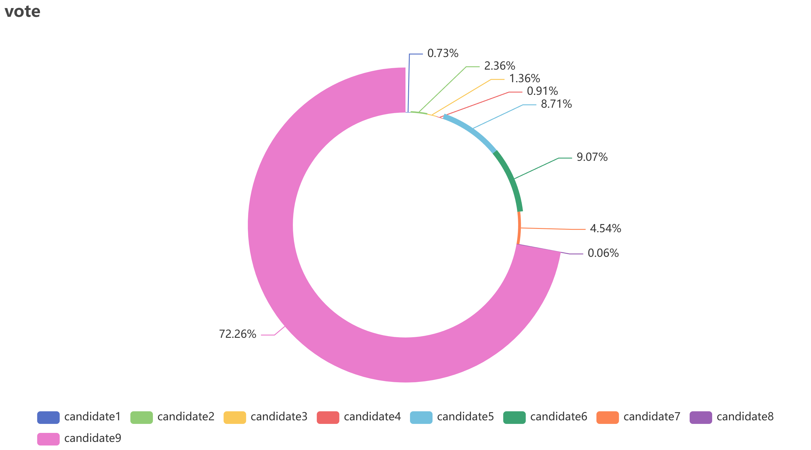

#### Configuration

```go
type PieItem struct {
    Name  string
    Value float64
}

type PieChartConfig struct {
    Width           string
    Height          string
    BackgroundColor string
    Theme           Theme
    Title           string
    Subtitle        string
    TitlePos        Position
    HideLegend      bool
    LegendPos       Position

    Colors      []string
    ShowLabels  bool
    ShowPercent bool
    LabelPos    LabelPosition
    RoseType    string   // "radius" or "area"
    Radius      []string // e.g. ["40%", "75%"]
    Center      []string // e.g. ["50%", "50%"]
}
```

#### Creation

```go
func CreatePieChart(config PieChartConfig, data ...PieItem) *charts.Pie
```

**Description:** Use when you need this function.

**Parameters:**

- `config`: Configuration options. Type: `PieChartConfig`.
- `data`: Variadic `PieItem` values.

**Returns:**

- `*charts.Pie`: Return value.

### 5. HeatMap

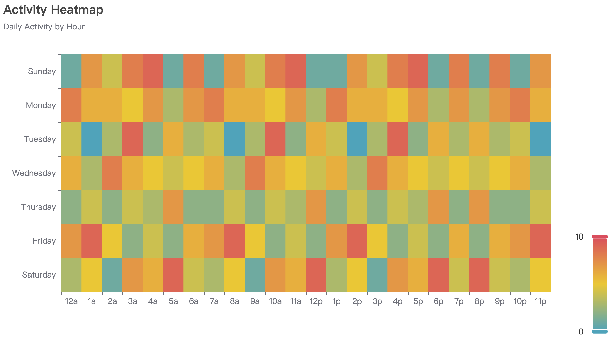

#### Configuration

```go
type HeatMapConfig struct {
    Width           string
    Height          string
    BackgroundColor string
    Theme           Theme
    Title           string
    Subtitle        string
    TitlePos        Position

    XAxis []string
    YAxis []string

    Colors []string
    Min    *float64
    Max    *float64

    UseCalendar  bool
    CalendarOpts *opts.Calendar
}
```

#### Creation

```go
// heapMapAxisValue can be int | string | time.Time
func CreateHeatMap[X heapMapAxisValue, Y heapMapAxisValue](config HeatMapConfig, points ...heatMapPoint[X, Y]) *charts.HeatMap
```

Helper functions:

- `HeatMapPoint(x, y, value)`
- `HeatMapMissingPoint(x, y)`

In calendar mode (`UseCalendar: true`) every X value must be a `time.Time` and `CalendarOpts` must be set. Otherwise a warning is logged and `nil` is returned.

### 6. Radar Chart

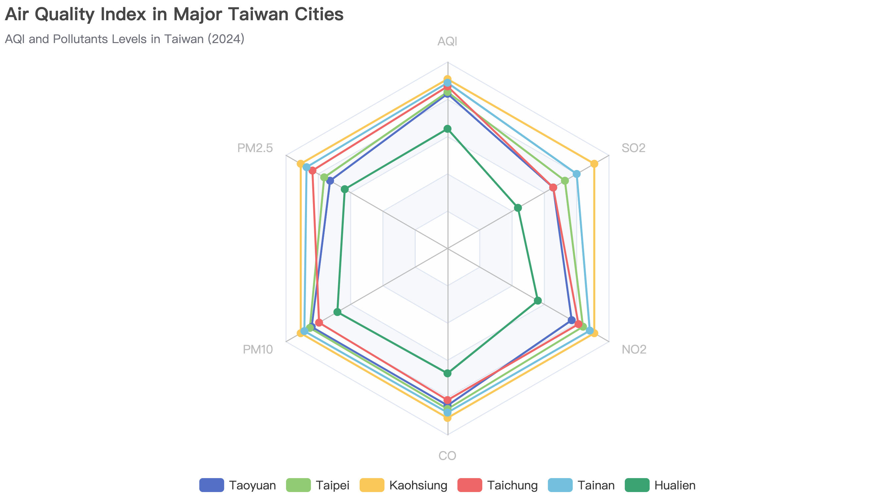

#### Configuration

```go
type RadarChartConfig struct {
    Width           string
    Height          string
    BackgroundColor string
    Theme           Theme
    Title           string
    Subtitle        string
    TitlePos        Position
    HideLegend      bool
    LegendPos       Position

    Indicators []string           // Dimension names
    MaxValues  map[string]float32 // Max value for each dimension
}

type RadarSeries struct {
    Name   string
    Values []float32
    Color  string
}
```

#### Creation

```go
func CreateRadarChart(config RadarChartConfig, series []RadarSeries) *charts.Radar
```

**Description:** Use when you need this function.

**Parameters:**

- `config`: Configuration options. Type: `RadarChartConfig`.
- `series`: Input value for `series`. Type: `[]RadarSeries`.

**Returns:**

- `*charts.Radar`: Return value.

When neither `Indicators` nor `MaxValues` is set, a warning is logged and the chart is returned without indicators, as it was before with `insyra.Config.SetDontPanic(true)`; earlier releases ended the program in the default configuration. Set `Indicators` to get a usable chart.

### 7. Funnel Chart

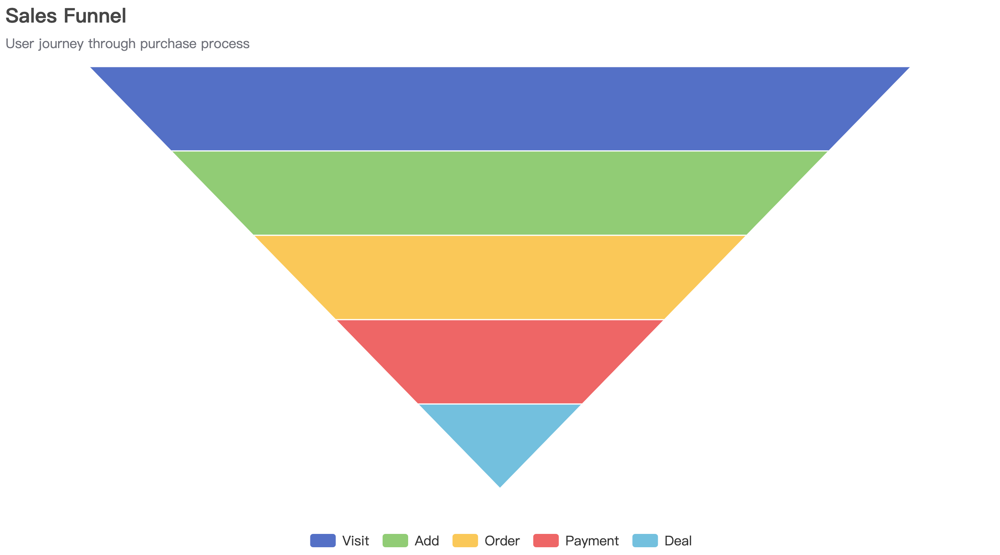

#### Configuration

```go
type FunnelChartConfig struct {
    Width           string
    Height          string
    BackgroundColor string
    Theme           Theme
    Title           string
    Subtitle        string
    TitlePos        Position
    HideLegend      bool
    LegendPos       Position

    ShowLabels bool
    LabelPos   LabelPosition
}
```

#### Creation

```go
func CreateFunnelChart(config FunnelChartConfig, data map[string]float64) *charts.Funnel
```

**Description:** Use when you need this function.

**Parameters:**

- `config`: Configuration options. Type: `FunnelChartConfig`.
- `data`: Input data values. Type: `map[string]float64`.

**Returns:**

- `*charts.Funnel`: Return value.

The data is a map, and the series is built by ranging over it, so the stage
order in the emitted option JSON is whatever Go's map iteration happens to
give, and it varies between calls in the same process. Build the `charts.Funnel`
series yourself from an ordered slice if the order has to be fixed.

### 8. Gauge Chart

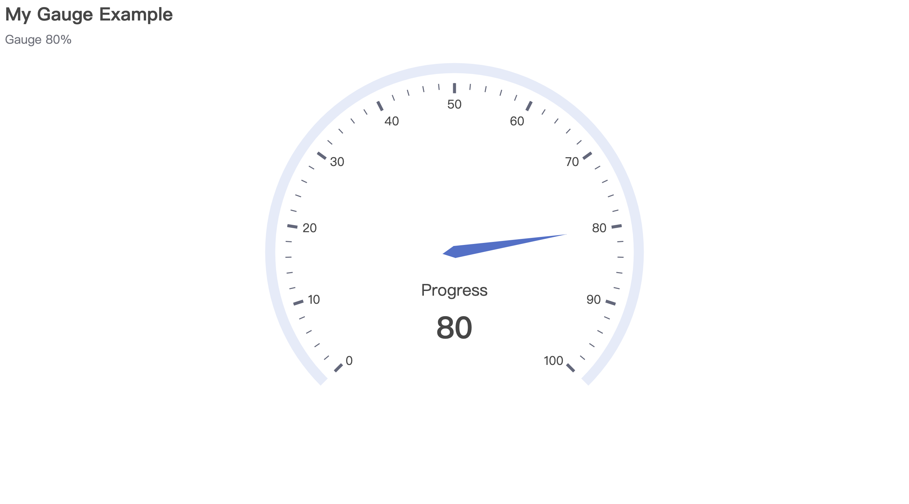

#### Configuration

```go
type GaugeChartConfig struct {
    Width           string
    Height          string
    BackgroundColor string
    Theme           Theme
    Title           string
    Subtitle        string
    TitlePos        Position
    HideLegend      bool
    LegendPos       Position

    SeriesName string
}
```

#### Creation

```go
func CreateGaugeChart(config GaugeChartConfig, value float64) *charts.Gauge
```

**Description:** Use when you need this function.

**Parameters:**

- `config`: Configuration options. Type: `GaugeChartConfig`.
- `value`: Input value for `value`. Type: `float64`.

**Returns:**

- `*charts.Gauge`: Return value.

### 9. WordCloud

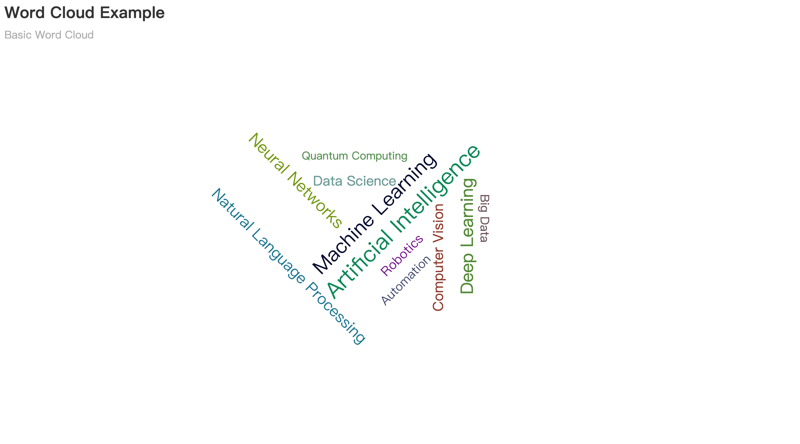

#### Configuration

```go
type WordCloudShape string

const (
    WordCloudShapeCircle    WordCloudShape = "circle"
    WordCloudShapeRect      WordCloudShape = "rect"
    WordCloudShapeRoundRect WordCloudShape = "roundRect"
    WordCloudShapeTriangle  WordCloudShape = "triangle"
    WordCloudShapeDiamond   WordCloudShape = "diamond"
    WordCloudShapePin       WordCloudShape = "pin"
    WordCloudShapeArrow     WordCloudShape = "arrow"
)

type WordCloudConfig struct {
    Width           string
    Height          string
    BackgroundColor string
    Theme           Theme
    Title           string
    Subtitle        string
    TitlePos        Position

    Shape     WordCloudShape
    SizeRange []float32      // e.g. [14, 80]
}
```

#### Creation

```go
func CreateWordCloud(config WordCloudConfig, data insyra.IDataList) *charts.WordCloud
```

**Description:** Use when you need this function.

**Parameters:**

- `config`: Configuration options. Type: `WordCloudConfig`.
- `data`: Input data values. Type: `insyra.IDataList`.

**Returns:**

- `*charts.WordCloud`: Return value.

`data` is counted into a frequency map — each distinct value in the list is one
word, weighted by how often it appears — and the series is built by ranging
over that map, so the word order in the emitted option JSON varies between
calls in the same process.

### 10. Sankey Chart

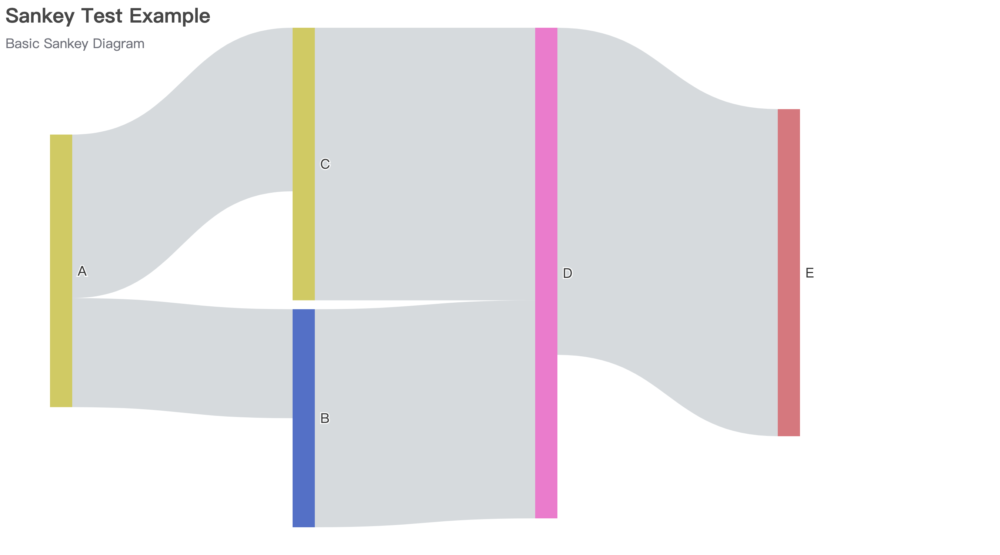

#### Configuration

```go
type SankeyLink struct {
    Source string  `json:"source"`
    Target string  `json:"target"`
    Value  float32 `json:"value"`
}

type SankeyChartConfig struct {
    Width           string
    Height          string
    BackgroundColor string
    Theme           Theme
    Title           string
    Subtitle        string
    TitlePos        Position

    Nodes      []string
    Curveness  float32
    Color      string
    ShowLabels bool
}
```

#### Creation

```go
func CreateSankeyChart(config SankeyChartConfig, links ...SankeyLink) *charts.Sankey
```

**Description:** Use when you need this function.

**Parameters:**

- `config`: Configuration options. Type: `SankeyChartConfig`.
- `links`: Variadic `SankeyLink` values.

**Returns:**

- `*charts.Sankey`: Return value.

### 11. BoxPlot

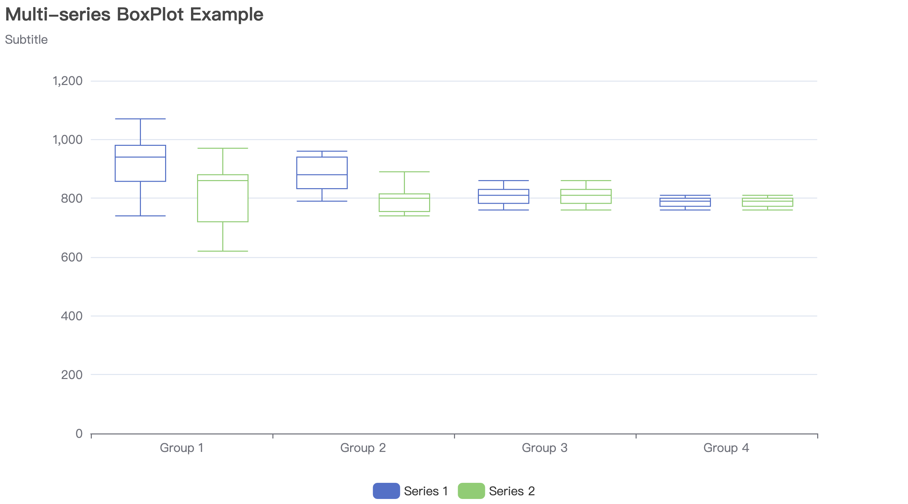

#### Configuration

```go
type BoxPlotSeries struct {
    Name  string
    Data  []insyra.IDataList
    Color string
    Fill  bool
}

type BoxPlotConfig struct {
    Width           string
    Height          string
    BackgroundColor string
    Theme           Theme
    Title           string
    Subtitle        string
    TitlePos        Position
    HideLegend      bool
    LegendPos       Position

    XAxis     []string
    XAxisName string
    YAxisName string
    YAxisMin         *float64
    YAxisMax         *float64
    YAxisSplitNumber *int
    YAxisFormatter   string
}
```

#### Creation

```go
func CreateBoxPlot(config BoxPlotConfig, series ...BoxPlotSeries) *charts.BoxPlot
```

**Description:** Use when you need this function.

**Parameters:**

- `config`: Configuration options. Type: `BoxPlotConfig`.
- `series`: Variadic `BoxPlotSeries` values.

**Returns:**

- `*charts.BoxPlot`: Return value.

### 12. K-Line Chart

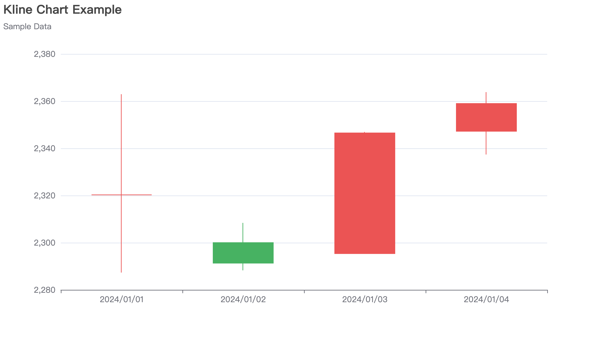

#### Configuration

```go
type KlinePoint struct {
    Date  time.Time `json:"date"`
    Open  float64   `json:"open"`
    High  float64   `json:"high"`
    Low   float64   `json:"low"`
    Close float64   `json:"close"`
}

type KlineChartConfig struct {
    Width           string
    Height          string
    BackgroundColor string
    Theme           Theme
    Title           string
    Subtitle        string
    TitlePos        Position

    DateFormat string // e.g. "YYYY-MM-DD"
    DataZoom   bool
}
```

#### Creation

```go
func CreateKlineChart(config KlineChartConfig, klinePoints ...KlinePoint) *charts.Kline
```

**Description:** Use when you need this function.

**Parameters:**

- `config`: Configuration options. Type: `KlineChartConfig`.
- `klinePoints`: Variadic `KlinePoint` values.

**Returns:**

- `*charts.Kline`: Return value.

### 13. ThemeRiver Chart

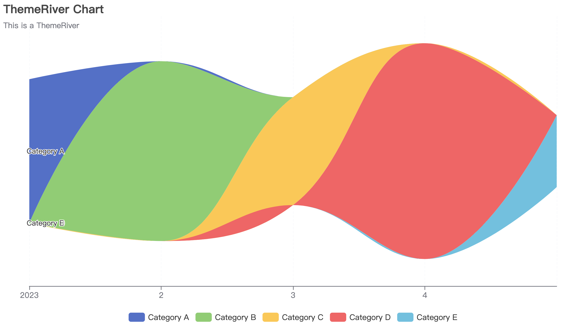

#### Configuration

```go
type ThemeRiverAxisType string

const (
    ThemeRiverAxisTypeTime ThemeRiverAxisType = "time"
)

type ThemeRiverData struct {
    Date  string  // format: "yyyy/MM/dd"
    Value float64
    Name  string
}

type ThemeRiverChartConfig struct {
    Width           string
    Height          string
    BackgroundColor string
    Theme           Theme
    Title           string
    Subtitle        string
    TitlePos        Position
    HideLegend      bool
    LegendPos       Position

    AxisType ThemeRiverAxisType
    AxisData []string
    AxisMin  *float64
    AxisMax  *float64
}
```

#### Creation

```go
func CreateThemeRiverChart(config ThemeRiverChartConfig, data ...ThemeRiverData) *charts.ThemeRiver
```

**Description:** Use when you need this function.

**Parameters:**

- `config`: Configuration options. Type: `ThemeRiverChartConfig`.
- `data`: Variadic `ThemeRiverData` values.

**Returns:**

- `*charts.ThemeRiver`: Return value.
