# [ plot ] Package

The `plot` package creates interactive web-based charts using [go-echarts](https://github.com/go-echarts/go-echarts). Charts can be saved as HTML files for web viewing or exported as PNG images.

**PNG export notes:**

- `SavePNG` renders via Chrome/Chromium when available.
- Local rendering needs Chrome/Chromium. Nothing leaves your machine unless you pass `true` as the third argument, which lets a failed local render fall back to HazelnutParadise's online renderer — that fallback uploads the whole chart, data included.

## Installation

```bash
go get github.com/HazelnutParadise/insyra/plot
```

## Quick Start

```go
package main

import (
    "log"

    "github.com/HazelnutParadise/insyra"
    "github.com/HazelnutParadise/insyra/plot"
)

func main() {
    // Create data
    sales := insyra.NewDataList(100, 150, 120, 180).SetName("Sales")

    // Create chart configuration
    config := plot.BarChartConfig{
        Title: "Monthly Sales",
        XAxis: []string{"Jan", "Feb", "Mar", "Apr"},
    }

    // Create and save chart
    chart, err := plot.CreateBarChart(config, sales)
    if err != nil {
        log.Fatal(err)
    }
    if err := plot.SaveHTML(chart, "sales.html"); err != nil {
        log.Fatal(err)
    }

    // Or save as PNG (requires Chrome/Chromium)
    if err := plot.SavePNG(chart, "sales.png"); err != nil {
        log.Fatal(err)
    }
}
```

## Supported Chart Types

| Chart      | Function                | Use Case                     |
| ---------- | ----------------------- | ---------------------------- |
| Bar        | `CreateBarChart`        | Category comparison          |
| Line       | `CreateLineChart`       | Trends over time             |
| Scatter    | `CreateScatterChart`    | Correlation analysis         |
| Pie        | `CreatePieChart`        | Part-to-whole relationships  |
| HeatMap    | `CreateHeatMap`         | Matrix visualization         |
| Radar      | `CreateRadarChart`      | Multi-dimensional comparison |
| Funnel     | `CreateFunnelChart`     | Stage-based processes        |
| Gauge      | `CreateGaugeChart`      | Single value display         |
| WordCloud  | `CreateWordCloud`       | Text frequency               |
| Sankey     | `CreateSankeyChart`     | Flow visualization           |
| BoxPlot    | `CreateBoxPlot`         | Distribution comparison      |
| K-Line     | `CreateKlineChart`      | Stock data                   |
| ThemeRiver | `CreateThemeRiverChart` | Temporal flow data           |

## Common Types

### Theme

The `Theme` type defines the visual style of the chart.

```go
type Theme string

const (
    ThemeChalk         Theme = "chalk"
    ThemeEssos         Theme = "essos"
    ThemeInfographic   Theme = "infographic"
    ThemeMacarons      Theme = "macarons"
    ThemePurplePassion Theme = "purple-passion"
    ThemeRoma          Theme = "roma"
    ThemeRomantic      Theme = "romantic"
    ThemeShine         Theme = "shine"
    ThemeVintage       Theme = "vintage"
    ThemeWalden        Theme = "walden"
    ThemeWesteros      Theme = "westeros"
    ThemeWonderland    Theme = "wonderland"
)
```

### Position

Used for positioning elements like titles and legends.

```go
type Position string

const (
    PositionTop    Position = "top"
    PositionBottom Position = "bottom"
    PositionLeft   Position = "left"
    PositionRight  Position = "right"
)
```

### LabelPosition

Used for positioning labels on chart elements.

```go
type LabelPosition string

const (
    LabelPositionTop               LabelPosition = "top"
    LabelPositionBottom            LabelPosition = "bottom"
    LabelPositionLeft              LabelPosition = "left"
    LabelPositionRight             LabelPosition = "right"
    LabelPositionInside            LabelPosition = "inside"
    LabelPositionInsideLeft        LabelPosition = "insideLeft"
    LabelPositionInsideRight       LabelPosition = "insideRight"
    LabelPositionInsideTop         LabelPosition = "insideTop"
    LabelPositionInsideBottom      LabelPosition = "insideBottom"
    LabelPositionInsideTopLeft     LabelPosition = "insideTopLeft"
    LabelPositionInsideBottomLeft  LabelPosition = "insideBottomLeft"
    LabelPositionInsideTopRight    LabelPosition = "insideTopRight"
    LabelPositionInsideBottomRight LabelPosition = "insideBottomRight"
)
```

## Things to be careful about

### A chart that cannot be built is an error

Every `Create...` function returns the chart and an `error`. When one cannot build a chart, usually because it was given no data, it returns a `nil` chart and an error that starts with the function's name, such as `plot: CreateBarChart: no data to draw`. A failing call logs nothing, so reporting the error is up to you. Each constructor's section below lists what it refuses. `CreateGaugeChart` takes a plain `float64` and cannot fail. Its error is always `nil`, and it returns one so that every constructor is called the same way.

Check the error before saving. `SaveHTML` and `SavePNG` do not check for a `nil` chart and panic with a nil pointer dereference when given one:

```go
chart, err := plot.CreateBarChart(config, data)
if err != nil {
    return err
}
err = plot.SaveHTML(chart, "sales.html")
```

### A `nil` list among real lists is skipped

`CreateBarChart`, `CreateLineChart` and `CreateBoxPlot` drop a `nil` list, whether a nil interface or a nil `*insyra.DataList`. They log a warning naming its position and draw the rest. When no list is left, the call returns an error and logs nothing. `CreateBoxPlot` also drops a series left with no lists, including one given no lists at all, with a warning naming the series. When no series is left, the result is an error saying that no series has any data. `CreateWordCloud` takes one list, so a `nil` list there is an error.

An empty list is not refused. The bar and line charts draw it as an empty series and return the chart.

### How a cell that is not a number is drawn

`CreateBarChart`, `CreateLineChart` and `CreateBoxPlot` read `insyra.IDataList` values, and none of them refuses a cell that is not a number. What each one does with such a cell, measured on 2026-09-28:

- **The Y axis is chosen from the cells' text.** While every cell's text parses as a number, the Y axis is numeric. A single cell whose text does not parse, such as a word, a `bool`, or `nil` (whose text is `<nil>`), turns the Y axis of the bar and line charts into categories. Each distinct text becomes a category, and every cell, the numbers included, is drawn at its category's position. `NewDataList(1, "abc", 3)` gives a Y axis labelled `1`, `abc`, `3`, with the bars at 0, 1 and 2.
- **On a numeric axis, a string is drawn as 0.** The values are read through `DataList.ToF64Slice`, which does not parse text, so `NewDataList(1, "2", 3)` is drawn as 1, 0, 3.
- **The box plot leaves such cells out.** Its five numbers come from the cells that are Go numbers, so `"5"`, `"abc"` and `nil` are ignored. Its Y axis is chosen from the text all the same, so one text cell makes it a category axis whose labels no longer match the boxes.
- **A `NaN` or an infinity leaves the page blank.** In any chart, bar values, pie slices or a gauge value alike, go-echarts cannot encode such a value and does not report the failure. `SaveHTML` writes a page with no chart on it and returns no error. A box plot list with no number in it, empty or all text, has a `NaN` summary and blanks the page the same way.

Clean a column before charting it rather than relying on any of this: `ParseNumbers` turns numeric text into numbers, and `ClearNilsAndNaNs` removes `nil` and `NaN` cells.

### Two constructors write into what you pass

- `CreateKlineChart` sorts its points by date in place. Called as `CreateKlineChart(cfg, points...)`, it reorders your `points` slice.
- `CreateRadarChart` fills in an empty `Color` on each element of the `series` slice you pass, and adds an entry to `config.MaxValues` for every indicator that has none. Your map is changed only when you supplied one; a `nil` `MaxValues` stays `nil` in your config.

`CreateBoxPlot` also assigns default colours, but to its own copy of the series, so your slice is unchanged.

### `Title` and `Subtitle` are HTML-escaped

go-echarts writes the chart options into a `<script>` block without escaping HTML, so text taken from user data could close that block and inject markup. Every constructor passes `Title` and `Subtitle` through `html.EscapeString` first. A title of `</script><script>alert(1)</script>` is written to the file as `&lt;/script&gt;&lt;script&gt;alert(1)&lt;/script&gt;`, and the chart still shows the text. Only these two fields are escaped; axis names, series names and data values are written as given.

---

## Saving Charts

### Save HTML

```go
func SaveHTML(chart Renderable, path string, animation ...bool) error
```

**Description:** Renders the chart to an HTML file.

**Parameters:**

- `chart`: The chart object. Type: `Renderable`.
- `path`: The file path to save the HTML. Type: `string`.
- `animation`: Optional boolean to enable/disable animation (default: enabled). At most one; passing two returns an error.

**Returns:**

- `error`: Error when the operation fails.

**Note:** two charts built from the same config produce different HTML files. go-echarts gives each chart object a random 12-character id when the chart is created and writes it into the page, including the `id` of the chart's `<div>`. Saving the same chart object twice gives identical files. Compare saved files by substring, or mask the id, rather than byte for byte.

### Save PNG

```go
func SavePNG(chart Renderable, pngPath string, useOnlineServiceOnFail ...bool) error
```

**Description:** Renders the chart to a PNG image with a local Chrome/Chromium. Off by default, an online fallback can be enabled per call; it sends the chart and its data to `server3.hazelnut-paradise.com`.

**Parameters:**

- `chart`: The chart object. Type: `Renderable`.
- `pngPath`: The file path to save the PNG. Type: `string`. It must carry a file extension — that is what chooses the image format — and `SavePNG` returns an error when it does not.
- `useOnlineServiceOnFail`: Optional boolean, default `false`. Pass `true` to allow the online rendering service when local rendering fails; the chart data is uploaded in that case.

**Returns:**

- `error`: Error when the operation fails.

---

## Chart Types

### 1. Bar Chart

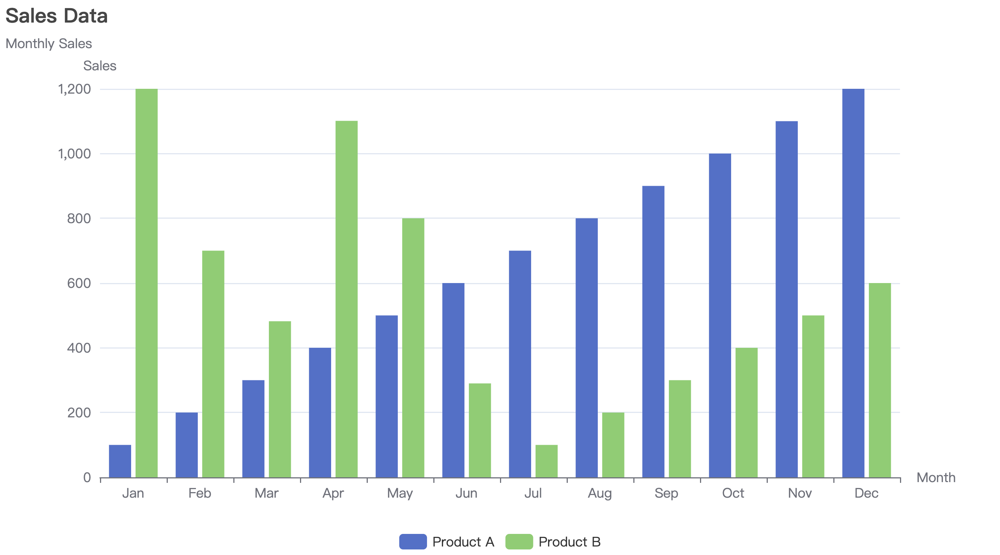

#### Configuration

```go
type BarChartConfig struct {
    Width           string   // Default "900px"
    Height          string   // Default "500px"
    BackgroundColor string   // Default "white"
    Theme           Theme
    Title           string
    Subtitle        string
    TitlePos        Position
    HideLegend      bool
    LegendPos       Position

    XAxis     []string // X-axis labels
    XAxisName string
    YAxisName string

    // Y-axis customization
    YAxisMin         *float64
    YAxisMax         *float64
    YAxisSplitNumber *int
    YAxisFormatter   string   // e.g. "{value}°C"

    Colors     []string
    ShowLabels bool
    LabelPos   LabelPosition
}
```

#### Creation

```go
func CreateBarChart(config BarChartConfig, data ...insyra.IDataList) (*charts.Bar, error)
```

**Description:** Draws one bar series per list, named after the list. A `nil` list among real ones is skipped with a warning. A cell that is not a number is drawn as described in [How a cell that is not a number is drawn](#how-a-cell-that-is-not-a-number-is-drawn).

**Parameters:**

- `config`: Configuration options. Type: `BarChartConfig`.
- `data`: Variadic `insyra.IDataList` values.

**Returns:**

- `*charts.Bar`: the chart, or `nil` when the error is non-nil.
- `error`: non-nil, with a `nil` chart, when no list is given, or every one is `nil`.

### 2. Line Chart

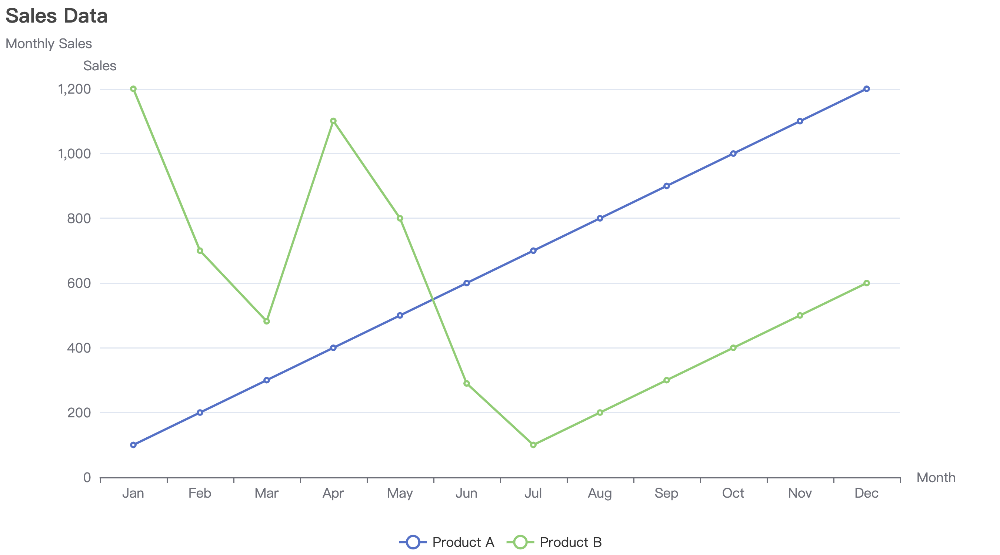

#### Configuration

```go
type LineChartConfig struct {
    Width           string
    Height          string
    BackgroundColor string
    Theme           Theme
    Title           string
    Subtitle        string
    TitlePos        Position
    HideLegend      bool
    LegendPos       Position

    XAxis     []string
    XAxisName string

    YAxisName        string
    YAxis            []string // Category labels for Y-axis
    YAxisMin         *float64
    YAxisMax         *float64
    YAxisSplitNumber *int
    YAxisFormatter   string

    Colors     []string
    ShowLabels bool
    LabelPos   string // "top", "bottom", "left", "right"
    Smooth     bool   // Smooth lines
    FillArea   bool   // Fill area under lines
}
```

#### Creation

```go
func CreateLineChart(config LineChartConfig, data ...insyra.IDataList) (*charts.Line, error)
```

**Description:** Draws one line per list, named after the list. A `nil` list among real ones is skipped with a warning. A cell that is not a number is drawn as described in [How a cell that is not a number is drawn](#how-a-cell-that-is-not-a-number-is-drawn).

**Parameters:**

- `config`: Configuration options. Type: `LineChartConfig`.
- `data`: Variadic `insyra.IDataList` values.

**Returns:**

- `*charts.Line`: the chart, or `nil` when the error is non-nil.
- `error`: non-nil, with a `nil` chart, when no list is given, or every one is `nil`.

### 3. Scatter Chart

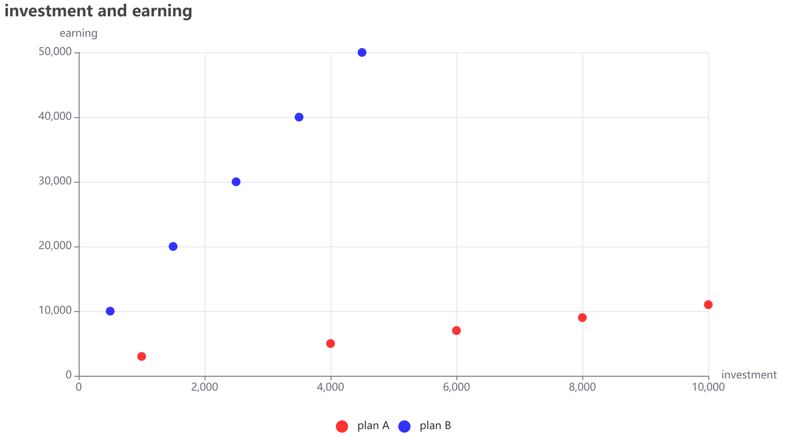

#### Configuration

```go
type ScatterPoint struct {
    X float64
    Y float64
}

type ScatterChartConfig struct {
    Width           string
    Height          string
    BackgroundColor string
    Theme           Theme
    Title           string
    Subtitle        string
    TitlePos        Position
    HideLegend      bool
    LegendPos       Position

    XAxisName        string
    XAxisMin         *float64
    XAxisMax         *float64
    XAxisSplitNumber *int
    XAxisFormatter   string

    YAxisName        string
    YAxisMin         *float64
    YAxisMax         *float64
    YAxisSplitNumber *int
    YAxisFormatter   string

    Colors     []string
    ShowLabels bool
    LabelPos   LabelPosition
    SplitLine  bool
    Symbol     []string // e.g. "circle", "rect"
    SymbolSize int
}
```

#### Creation

```go
func CreateScatterChart(config ScatterChartConfig, data map[string][]ScatterPoint) (*charts.Scatter, error)
```

**Description:** Draws one series per map entry, named after its key. The series are added in the keys' sorted order, so their colours and symbols are the same on every run.

**Parameters:**

- `config`: Configuration options. Type: `ScatterChartConfig`.
- `data`: Input data values. Type: `map[string][]ScatterPoint`.

**Returns:**

- `*charts.Scatter`: the chart, or `nil` when the error is non-nil.
- `error`: non-nil, with a `nil` chart, when `data` is empty.

### 4. Pie Chart

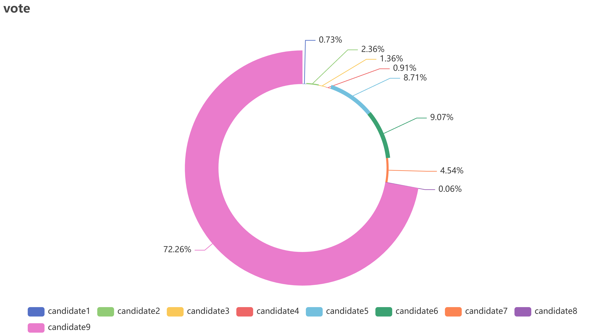

#### Configuration

```go
type PieItem struct {
    Name  string
    Value float64
}

type PieChartConfig struct {
    Width           string
    Height          string
    BackgroundColor string
    Theme           Theme
    Title           string
    Subtitle        string
    TitlePos        Position
    HideLegend      bool
    LegendPos       Position

    Colors      []string
    ShowLabels  bool
    ShowPercent bool
    LabelPos    LabelPosition
    RoseType    string   // "radius" or "area"
    Radius      []string // e.g. ["40%", "75%"]
    Center      []string // e.g. ["50%", "50%"]
}
```

#### Creation

```go
func CreatePieChart(config PieChartConfig, data ...PieItem) (*charts.Pie, error)
```

**Description:** Draws one slice per item.

**Parameters:**

- `config`: Configuration options. Type: `PieChartConfig`.
- `data`: Variadic `PieItem` values.

**Returns:**

- `*charts.Pie`: the chart, or `nil` when the error is non-nil.
- `error`: non-nil, with a `nil` chart, when no item is given.

### 5. HeatMap

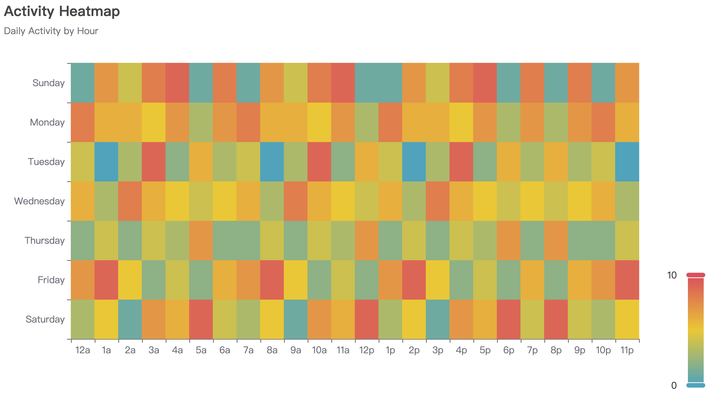

#### Configuration

```go
type HeatMapConfig struct {
    Width           string
    Height          string
    BackgroundColor string
    Theme           Theme
    Title           string
    Subtitle        string
    TitlePos        Position

    XAxis []string
    YAxis []string

    Colors []string
    Min    *float64
    Max    *float64

    UseCalendar  bool
    CalendarOpts *opts.Calendar
}
```

#### Creation

```go
// An axis is an int index, a string label, or a time.Time (calendar mode).
type HeatMapAxis interface{ int | string | time.Time }

// HeatMapPoint is one cell; Valid is false for a cell with no value ("-").
type HeatMapPoint[X HeatMapAxis, Y HeatMapAxis] struct {
    X, Y  ...
    Value float64
    Valid bool
}

func NewHeatMapPoint[X HeatMapAxis, Y HeatMapAxis](x X, y Y, value float64) HeatMapPoint[X, Y]
func NewHeatMapMissingPoint[X HeatMapAxis, Y HeatMapAxis](x X, y Y) HeatMapPoint[X, Y]
func CreateHeatMap[X HeatMapAxis, Y HeatMapAxis](config HeatMapConfig, points ...HeatMapPoint[X, Y]) (*charts.HeatMap, error)
```

`CreateHeatMap` returns a `nil` chart and an error when no point is given. With `UseCalendar` set, it also does so when a point's `X` is not a `time.Time` or `CalendarOpts` is `nil`.

Because the point type is exported, points can be collected in a loop:

```go
var points []plot.HeatMapPoint[int, int]
for x := 0; x < 7; x++ {
    for y := 0; y < 24; y++ {
        points = append(points, plot.NewHeatMapPoint(x, y, counts[x][y]))
    }
}
chart, err := plot.CreateHeatMap(plot.HeatMapConfig{Title: "Activity"}, points...)
```

### 6. Radar Chart

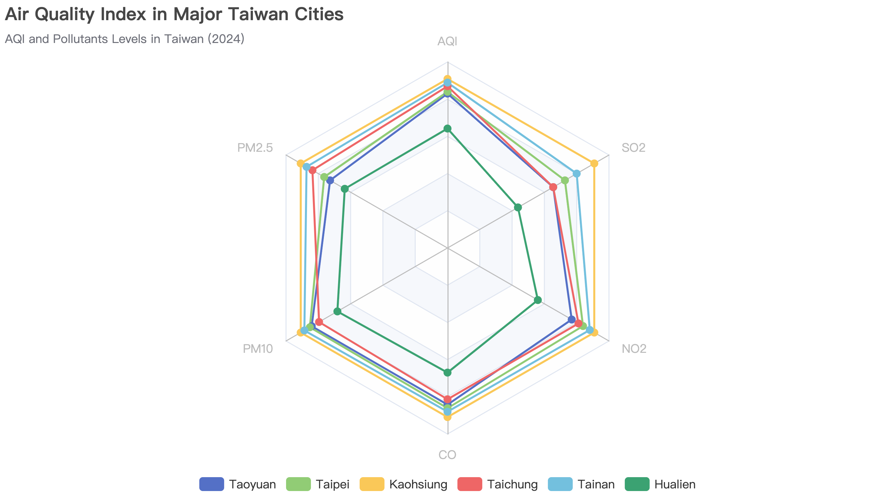

#### Configuration

```go
type RadarChartConfig struct {
    Width           string
    Height          string
    BackgroundColor string
    Theme           Theme
    Title           string
    Subtitle        string
    TitlePos        Position
    HideLegend      bool
    LegendPos       Position

    Indicators []string           // Dimension names
    MaxValues  map[string]float32 // Max value for each dimension
}

type RadarSeries struct {
    Name   string
    Values []float32
    Color  string
}
```

#### Creation

```go
func CreateRadarChart(config RadarChartConfig, series []RadarSeries) (*charts.Radar, error)
```

**Description:** Draws one polygon per series against the indicators: `config.Indicators`, or the sorted keys of `config.MaxValues` when `Indicators` is empty. A `MaxValues` key that is not an indicator is ignored with a warning.

**Parameters:**

- `config`: Configuration options. Type: `RadarChartConfig`.
- `series`: Input value for `series`. Type: `[]RadarSeries`.

**Returns:**

- `*charts.Radar`: the chart, or `nil` when the error is non-nil.
- `error`: non-nil, with a `nil` chart, when `series` is empty, or `config` has neither `Indicators` nor `MaxValues`.

### 7. Funnel Chart

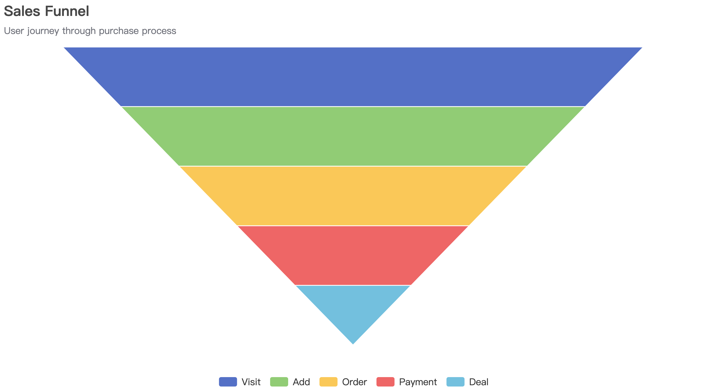

#### Configuration

```go
type FunnelChartConfig struct {
    Width           string
    Height          string
    BackgroundColor string
    Theme           Theme
    Title           string
    Subtitle        string
    TitlePos        Position
    HideLegend      bool
    LegendPos       Position

    ShowLabels bool
    LabelPos   LabelPosition
}
```

#### Creation

```go
func CreateFunnelChart(config FunnelChartConfig, data map[string]float64) (*charts.Funnel, error)
```

**Description:** Draws a funnel. `data` maps each stage's name to its value.

**Parameters:**

- `config`: Configuration options. Type: `FunnelChartConfig`.
- `data`: Input data values. Type: `map[string]float64`.

**Returns:**

- `*charts.Funnel`: the chart, or `nil` when the error is non-nil.
- `error`: non-nil, with a `nil` chart, when `data` is empty.

The stages come from a map and the series is built by ranging over it, so the order of the stages in the generated chart options changes from call to call.

### 8. Gauge Chart

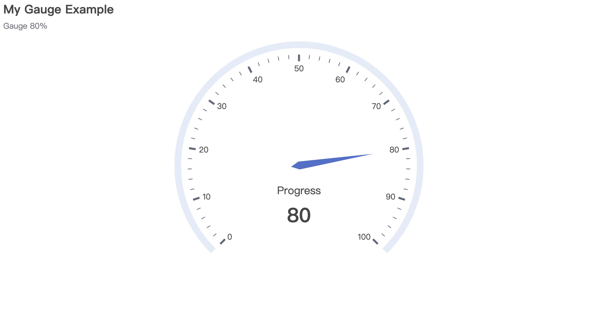

#### Configuration

```go
type GaugeChartConfig struct {
    Width           string
    Height          string
    BackgroundColor string
    Theme           Theme
    Title           string
    Subtitle        string
    TitlePos        Position
    HideLegend      bool
    LegendPos       Position

    SeriesName string
}
```

#### Creation

```go
func CreateGaugeChart(config GaugeChartConfig, value float64) (*charts.Gauge, error)
```

**Description:** Draws a gauge showing `value`.

**Parameters:**

- `config`: Configuration options. Type: `GaugeChartConfig`.
- `value`: Input value for `value`. Type: `float64`.

**Returns:**

- `*charts.Gauge`: the chart.
- `error`: always `nil`. The gauge returns one so that every constructor has the same shape.

### 9. WordCloud

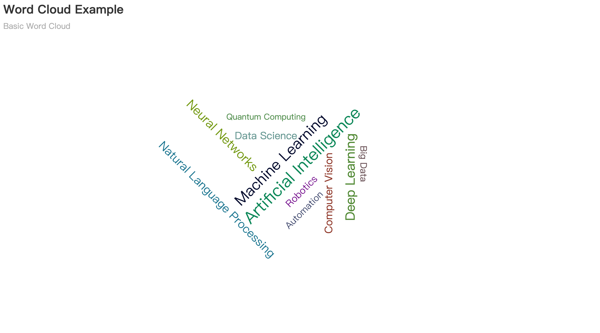

#### Configuration

```go
type WordCloudShape string

const (
    WordCloudShapeCircle    WordCloudShape = "circle"
    WordCloudShapeRect      WordCloudShape = "rect"
    WordCloudShapeRoundRect WordCloudShape = "roundRect"
    WordCloudShapeTriangle  WordCloudShape = "triangle"
    WordCloudShapeDiamond   WordCloudShape = "diamond"
    WordCloudShapePin       WordCloudShape = "pin"
    WordCloudShapeArrow     WordCloudShape = "arrow"
)

type WordCloudConfig struct {
    Width           string
    Height          string
    BackgroundColor string
    Theme           Theme
    Title           string
    Subtitle        string
    TitlePos        Position

    Shape     WordCloudShape
    SizeRange []float32      // e.g. [14, 80]
}
```

#### Creation

```go
func CreateWordCloud(config WordCloudConfig, data insyra.IDataList) (*charts.WordCloud, error)
```

**Description:** Draws each distinct value in `data` as a word, sized by how many times it occurs. A value that is not a string is shown as its text.

**Parameters:**

- `config`: Configuration options. Type: `WordCloudConfig`.
- `data`: Input data values. Type: `insyra.IDataList`.

**Returns:**

- `*charts.WordCloud`: the chart, or `nil` when the error is non-nil.
- `error`: non-nil, with a `nil` chart, when `data` is `nil` or empty.

Each distinct value in `data` is one word, weighted by how many times it appears. The words are collected in a map, so their order in the generated chart options changes from call to call.

### 10. Sankey Chart

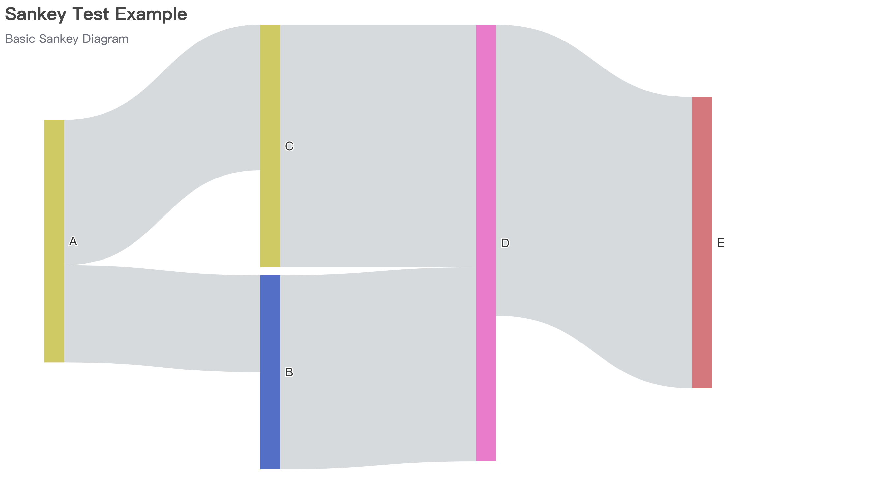

#### Configuration

```go
type SankeyLink struct {
    Source string  `json:"source"`
    Target string  `json:"target"`
    Value  float32 `json:"value"`
}

type SankeyChartConfig struct {
    Width           string
    Height          string
    BackgroundColor string
    Theme           Theme
    Title           string
    Subtitle        string
    TitlePos        Position

    Nodes      []string
    Curveness  float32
    Color      string
    ShowLabels bool
}
```

#### Creation

```go
func CreateSankeyChart(config SankeyChartConfig, links ...SankeyLink) (*charts.Sankey, error)
```

**Description:** Draws a Sankey diagram of the links between `config.Nodes`.

**Parameters:**

- `config`: Configuration options. Type: `SankeyChartConfig`.
- `links`: Variadic `SankeyLink` values.

**Returns:**

- `*charts.Sankey`: the chart, or `nil` when the error is non-nil.
- `error`: non-nil, with a `nil` chart, when no link is given.

### 11. BoxPlot

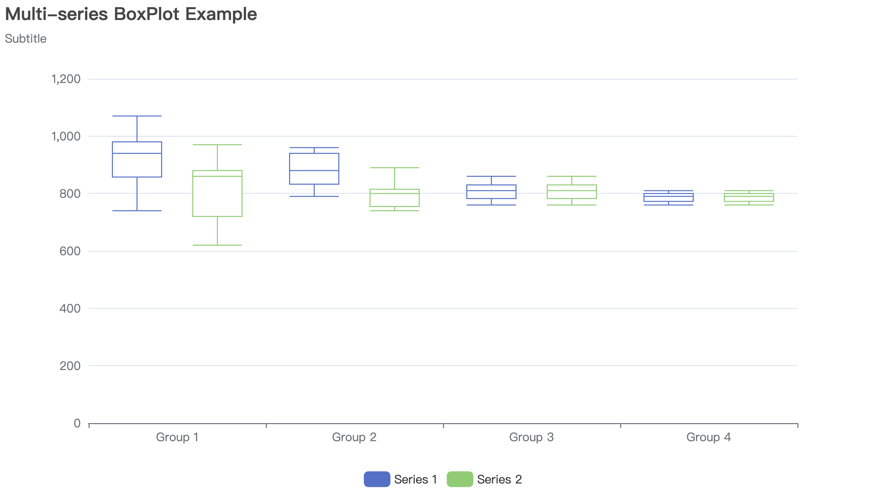

#### Configuration

```go
type BoxPlotSeries struct {
    Name  string
    Data  []insyra.IDataList
    Color string
    Fill  bool
}

type BoxPlotConfig struct {
    Width           string
    Height          string
    BackgroundColor string
    Theme           Theme
    Title           string
    Subtitle        string
    TitlePos        Position
    HideLegend      bool
    LegendPos       Position

    XAxis     []string
    XAxisName string
    YAxisName string
    YAxisMin         *float64
    YAxisMax         *float64
    YAxisSplitNumber *int
    YAxisFormatter   string
}
```

Each series' `Data` holds one list per category: the first list is the first box on the X axis. Without `XAxis` the categories are named `Category 1`, `Category 2`, and so on. Every series is cut to the number of lists in the shortest series, and to the length of `XAxis` when that is shorter.

#### Creation

```go
func CreateBoxPlot(config BoxPlotConfig, series ...BoxPlotSeries) (*charts.BoxPlot, error)
```

**Description:** Draws one box per list in each series: the minimum, the three quartiles and the maximum of the cells that are Go numbers. A `nil` list is skipped with a warning, and so is a series left with no lists. For cells that are not numbers, see [How a cell that is not a number is drawn](#how-a-cell-that-is-not-a-number-is-drawn).

**Parameters:**

- `config`: Configuration options. Type: `BoxPlotConfig`.
- `series`: Variadic `BoxPlotSeries` values.

**Returns:**

- `*charts.BoxPlot`: the chart, or `nil` when the error is non-nil.
- `error`: non-nil, with a `nil` chart, when no series is given, or no series has a list to draw.

### 12. K-Line Chart

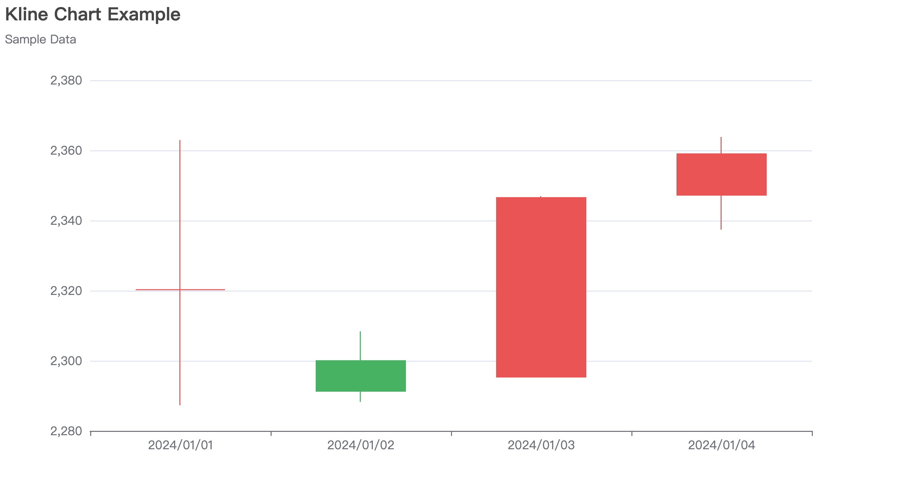

#### Configuration

```go
type KlinePoint struct {
    Date  time.Time `json:"date"`
    Open  float64   `json:"open"`
    High  float64   `json:"high"`
    Low   float64   `json:"low"`
    Close float64   `json:"close"`
}

type KlineChartConfig struct {
    Width           string
    Height          string
    BackgroundColor string
    Theme           Theme
    Title           string
    Subtitle        string
    TitlePos        Position

    DateFormat string // e.g. "YYYY-MM-DD"
    DataZoom   bool
}
```

#### Creation

```go
func CreateKlineChart(config KlineChartConfig, klinePoints ...KlinePoint) (*charts.Kline, error)
```

**Description:** Draws a candlestick chart of the points in date order. It sorts `klinePoints` in place.

**Parameters:**

- `config`: Configuration options. Type: `KlineChartConfig`.
- `klinePoints`: Variadic `KlinePoint` values.

**Returns:**

- `*charts.Kline`: the chart, or `nil` when the error is non-nil.
- `error`: non-nil, with a `nil` chart, when no point is given.

### 13. ThemeRiver Chart

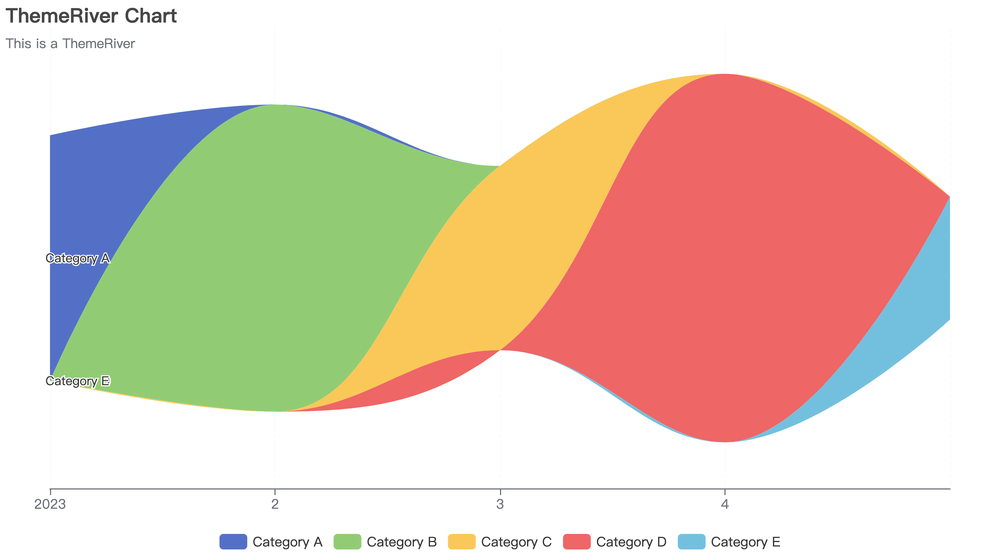

#### Configuration

```go
type ThemeRiverAxisType string

const (
    ThemeRiverAxisTypeTime ThemeRiverAxisType = "time"
)

type ThemeRiverData struct {
    Date  string  // format: "yyyy/MM/dd"
    Value float64
    Name  string
}

type ThemeRiverChartConfig struct {
    Width           string
    Height          string
    BackgroundColor string
    Theme           Theme
    Title           string
    Subtitle        string
    TitlePos        Position
    HideLegend      bool
    LegendPos       Position

    AxisType ThemeRiverAxisType
    AxisData []string
    AxisMin  *float64
    AxisMax  *float64
}
```

#### Creation

```go
func CreateThemeRiverChart(config ThemeRiverChartConfig, data ...ThemeRiverData) (*charts.ThemeRiver, error)
```

**Description:** Draws a theme river with one stream per `Name`.

**Parameters:**

- `config`: Configuration options. Type: `ThemeRiverChartConfig`.
- `data`: Variadic `ThemeRiverData` values.

**Returns:**

- `*charts.ThemeRiver`: the chart, or `nil` when the error is non-nil.
- `error`: non-nil, with a `nil` chart, when no data is given.
