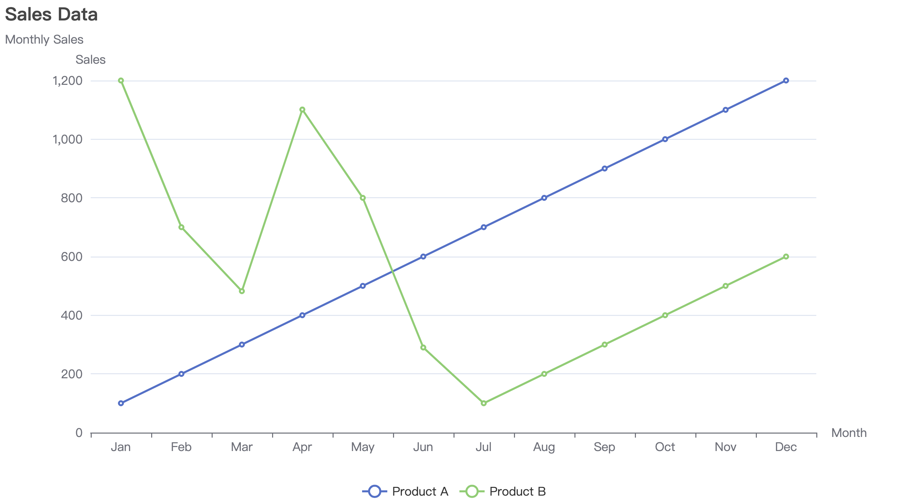
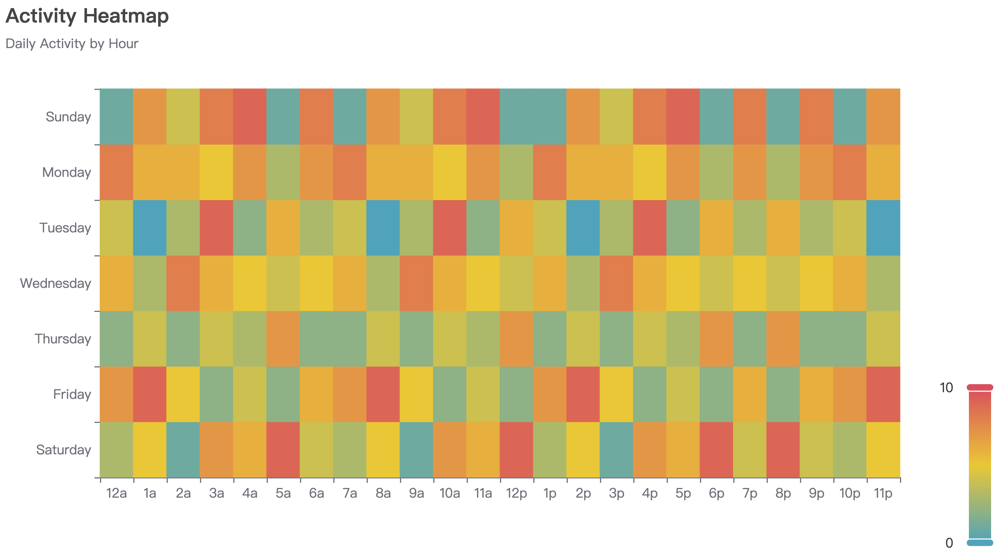
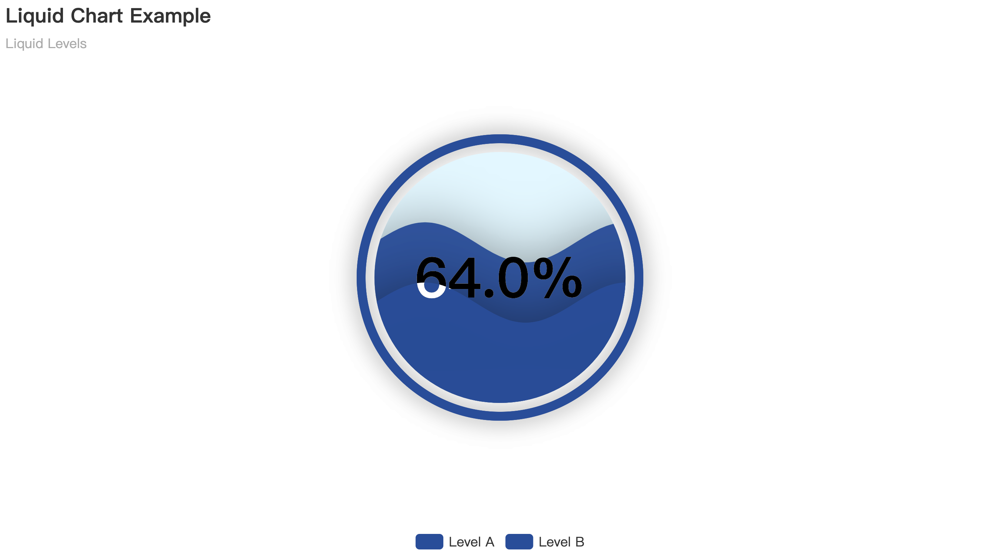

# [ plot ] Package

The `plot` package is a wrapper around the powerful [github.com/go-echarts/go-echarts](https://github.com/go-echarts/go-echarts) library, designed to simplify data visualization. It provides an easy-to-use interface for generating common chart types, such as bar charts and line charts, while also giving users the flexibility to leverage the full power of `go-echarts` for more advanced customizations.

This package is perfect for users who want to quickly visualize their data without needing to write verbose code. Advanced users can still access and configure all the underlying `go-echarts` features for more complex use cases.

---

## Installation

```bash
go get github.com/HazelnutParadise/insyra/plot
```

---

## Usage Example

> We recommend using `[]*insyra.DataList` as `SeriesData` for better performance and flexibility, ensuring that the data is in the correct order, while `map[string][]float64` does not.

### 1. Using `map[string][]float64`

This example shows how to create a bar chart using `map[string][]float64` as the `SeriesData`.

```go
package main

import (
	"github.com/HazelnutParadise/insyra/plot"
)

func main() {
	config := plot.BarChartConfig{
		Title:      "Sales Data",
		Subtitle:   "Monthly Sales",
		XAxis:      []string{"January", "February", "March"},
		SeriesData: map[string][]float64{
			"Product A": {120, 200, 150},
			"Product B": {80, 160, 90},
		},
		ShowLabels: true,
		Colors:     []string{"#5470C6", "#91CC75"},
	}

	// Create a bar chart
	barChart := plot.CreateBarChart(config)

	// Save the chart as an HTML file
	plot.SaveHTML(barChart, "sales_data_map.html")

	// Save the chart as a PNG file
	plot.SavePNG(barChart, "sales_data_map.png")
}
```

### 2. Using `insyra.DataList`

This example demonstrates how to create a bar chart using `[]*insyra.DataList` as the `SeriesData`.

```go
package main

import (
	"github.com/HazelnutParadise/insyra"
	"github.com/HazelnutParadise/insyra/plot"
)

func main() {
	// Create DataList objects for different products
	dataListA := insyra.NewDataList(120, 200, 150).SetName("Product A")

	dataListB := insyra.NewDataList(80, 160, 90).SetName("Product B")

	config := plot.BarChartConfig{
		Title:      "Sales Data",
		Subtitle:   "Monthly Sales",
		XAxis:      []string{"January", "February", "March"},
		SeriesData: []*insyra.DataList{dataListA, dataListB},
		ShowLabels: true,
		Colors:     []string{"#5470C6", "#91CC75"},
	}

	// Create a bar chart
	barChart := plot.CreateBarChart(config)

	// Save the chart as an HTML file
	plot.SaveHTML(barChart, "sales_data_datalist.html")

	// Save the chart as a PNG file
	plot.SavePNG(barChart, "sales_data_datalist.png")
}
```

---

## Features

### Bar Chart

#### `BarChartConfig`

- `Title`: The title of the chart.
- `Subtitle`: The subtitle of the chart.
- `XAxis`: Data for the X-axis (categories).
- `SeriesData`: The data for the series. Supported types:
  - `map[string][]float64`: A map where keys are series names, and values are data points.
  - `[]*insyra.DataList`: A list of `DataList` structures.
  - `[]insyra.IDataList`: A list of `IDataList` interface implementations.
- `XAxisName` (optional): Name for the X-axis.
- `YAxisName` (optional): Name for the Y-axis.
- `YAxisNameGap` (optional): Gap between the Y-axis name and the chart.
- `Colors` (optional): Colors for the bars.
- `ShowLabels` (optional): Display labels on the bars.
- `LabelPos` (optional): Position of the labels (e.g., "top", "bottom"). Default is "top".
- `GridTop` (optional): Space between the top of the chart and the title. Default is `"80"`.

#### `CreateBarChart`

`func CreateBarChart(config BarChartConfig) *charts.Bar`

Creates a bar chart based on the provided `BarChartConfig` and returns a `*charts.Bar` object, which can be customized further using `go-echarts` options.

#### Example


### Line Chart

#### `LineChartConfig`

- `Title`: The title of the chart.
- `Subtitle`: The subtitle of the chart.
- `XAxis`: Data for the X-axis (categories).
- `SeriesData`: The data for the series. Supported types:
  - `map[string][]float64`: A map where keys are series names, and values are data points.
  - `[]*insyra.DataList`: A list of `DataList` structures.
  - `[]insyra.IDataList`: A list of `IDataList` interface implementations.
- `XAxisName` (optional): Name for the X-axis.
- `YAxisName` (optional): Name for the Y-axis.
- `YAxisNameGap` (optional): Gap between the Y-axis name and the chart.
- `Colors` (optional): Colors for the lines.
- `ShowLabels` (optional): Display labels on the lines.
- `LabelPos` (optional): Position of the labels (e.g., "top", "bottom"). Default is "top".
- `Smooth` (optional): Make the lines smooth.
- `FillArea` (optional): Fill the area under the lines.
- `GridTop` (optional): Space between the top of the chart and the title. Default is `"80"`.

#### `CreateLineChart`

`func CreateLineChart(config LineChartConfig) *charts.Line`

Creates a line chart based on the provided `LineChartConfig` and returns a `*charts.Line` object, which can be customized further using `go-echarts` options.

#### Example


### Pie Chart

#### `PieChartConfig`

- `Title`: The title of the pie chart.
- `Subtitle`: The subtitle of the pie chart.
- `SeriesData`: The data for the pie slices. Supported types:
  - `[]float64`: A list of float values representing each slice's value.
  - `*insyra.DataList`: `DataList` structure.
  - `insyra.IDataList`: `IDataList` interface implementation.
- `Labels`: The labels for each pie slice (e.g., category names). Must match the length of `SeriesData`.
- `Colors` (optional): Colors for the slices.
- `ShowLabels` (optional): Display labels on the slices. Default is `false`.
- `LabelPos` (optional): Position of the labels (e.g., "inside", "outside"). Default is `"outside"`.
- `RoseType` (optional): The rose type of the pie chart. Use `"radius"` or `"area"` to create rose charts.
- `Radius` (optional): Radius configuration for the pie chart. Example: `["40%", "75%"]` for inner and outer radius.
- `Center` (optional): Position of the pie chart center. Example: `["50%", "50%"]`.
- `ShowPercent` (optional): Show the percentage of each slice on the labels. Default is `false`.

#### `CreatePieChart`

`func CreatePieChart(config PieChartConfig) *charts.Pie`

Creates a pie chart based on the provided `PieChartConfig` and returns a `*charts.Pie` object, which can be customized further using `go-echarts` options.

#### Example


### Scatter Chart

#### `ScatterChartConfig`

- `Title`: The title of the scatter chart.
- `Subtitle`: The subtitle of the scatter chart.
- `SeriesData`: The data for the scatter points. Supported types:
  - `map[string][][]float64`: A map where keys are series names, and values are two-dimensional data (X, Y).
- `XAxisName` (optional): The name of the X-axis.
- `YAxisName` (optional): The name of the Y-axis.
- `Colors` (optional): Colors for the scatter points.
- `ShowLabels` (optional): Display labels on the scatter points. Default is `false`.
- `LabelPos` (optional): Position of the labels (e.g., "right"). Default is `"right"`.
- `GridTop` (optional): Space between the top of the chart and the title. Default is `"80"`.
- `SplitLine` (optional): Whether to show split lines on the X and Y axes. Default is `false`.
- `Symbol` (optional): Symbol of the scatter points. Repeat the symbol if the length is less than the number of scatter points (e.g. `["circle", "triangle"]` will be `["circle", "triangle", "circle", "triangle"]`). Options: `["circle", "rect", "triangle", "diamond", "roundRect"]`.
- `SymbolSize` (optional): Size of the scatter points. Default is `10`.

#### `CreateScatterChart`

`func CreateScatterChart(config ScatterChartConfig) *charts.Scatter`

Creates a scatter chart based on the provided `ScatterChartConfig` and returns a `*charts.Scatter` object, which can be further customized with `go-echarts` options.

#### Example


### Heatmap Chart

#### `HeatmapChartConfig`

- `Title`: The title of the heatmap.
- `Subtitle`: The subtitle of the heatmap.
- `XAxis`: Data for the X-axis (categories).
- `YAxis`: Data for the Y-axis (categories).
- `Data`: The data for the heatmap.
- `Colors`: Colors for the heatmap. Default is `["#50a3ba", "#eac736", "#d94e5d"]`.
- `Min`: Minimum value for the heatmap.
- `Max`: Maximum value for the heatmap.
- `GridTop` (optional): Space between the top of the chart and the title. Default is `"80"`.

#### `CreateHeatmapChart`

`func CreateHeatmapChart(config HeatmapChartConfig) *charts.HeatMap`

Creates a heatmap chart based on the provided `HeatmapChartConfig` and returns a `*charts.HeatMap` object, which can be further customized with `go-echarts` options.

#### Example


### Liquid Chart

#### `LiquidChartConfig`

- `Title`: The title of the liquid chart.
- `Subtitle`: The subtitle of the liquid chart.
- `SeriesData`: The data for the liquid chart. Supported types:
  - `map[string]float32`: A map where keys are series names, and values are float values.
- `ShowLabels` (optional): Display labels on the liquid chart.
- `IsWaveAnimation` (optional): Enable/Disable wave animation.
- `Shape` (optional): Shape of the liquid chart (e.g., "diamond", "pin", "arrow", "triangle").

#### `CreateLiquidChart`

`func CreateLiquidChart(config LiquidChartConfig) *charts.Liquid`

Creates a liquid chart based on the provided `LiquidChartConfig` and returns a `*charts.Liquid` object, which can be further customized with `go-echarts` options.

#### Example


### Word Cloud

#### `WordCloudConfig`

- `Title`: The title of the word cloud.
- `Subtitle`: The subtitle of the word cloud.
- `SeriesData`: The data for the word cloud. Supported types:
  - `map[string]float32`: A map where keys are words, and values are float values.
- `Shape` (optional): Shape of the word cloud (e.g., "circle", "cardioid", "star").
- `SizeRange` (optional): Size range for the words, e.g., [14, 80].

#### `CreateWordCloud`

`func CreateWordCloud(config WordCloudConfig) *charts.WordCloud`

Creates a word cloud based on the provided `WordCloudConfig` and returns a `*charts.WordCloud` object, which can be further customized with `go-echarts` options.

#### Example


### Radar Chart

#### `RadarChartConfig`

- `Title`: The title of the radar chart.
- `Subtitle`: The subtitle of the radar chart.
- `Indicators` (optional): The indicators for the radar chart. Automatically generated if not provided.
- `MaxValues` (optional): The maximum values for the indicators. Automatically generated if not provided.
- `SeriesData`: The data for the radar chart. Supported types:
  - `map[string]map[string]float32`: A map where keys are series names, and values are maps of indicator names and their corresponding values.

#### `CreateRadarChart`

`func CreateRadarChart(config RadarChartConfig) *charts.Radar`

Creates a radar chart based on the provided `RadarChartConfig` and returns a `*charts.Radar` object, which can be further customized with `go-echarts` options.

#### Example


### Box Plot

#### `BoxPlotConfig`

- `Title`: The title of the box plot.
- `Subtitle`: The subtitle of the box plot.
- `XAxis`: Data for the X-axis (categories).
- `SeriesData`: The data for the box plot. Supported types:
  - `map[string][][]float64`: A map where keys are series names, and values are float64 slices.
  - `map[string][]*insyra.DataList`: A map where keys are series names, and values are `DataList` structures.
  - `map[string]insyra.IDataList`: A map where keys are series names, and values are `IDataList` interface implementations.
- `GridTop` (optional): Space between the top of the chart and the title. Default is `"80"`.

#### `CreateBoxPlot`

`func CreateBoxPlot(config BoxPlotConfig) *charts.BoxPlot`

Creates a box plot chart based on the provided `BoxPlotConfig` and returns a `*charts.BoxPlot` object, which can be further customized with `go-echarts` options.

#### Example


### K-Line Chart

#### `KlineChartConfig`

- `Title`: The title of the K-line chart.
- `Subtitle`: The subtitle of the K-line chart.
- `SeriesData`: The data for the K-line chart. Supported types:
  - `map[string][4]float32`: A map where keys are dates, and values are arrays of [open, close, high, low] float values.
  - `[]*insyra.DataList`: A list of `DataList` structures, each containing the open, close, highest, and lowest values, and the date as the name.
  - `[]insyra.IDataList`: A list of `IDataList` interface implementations.
- `DataZoom` (optional): Enable/Disable data zoom.

#### `CreateKlineChart`

`func CreateKlineChart(config KlineChartConfig) *charts.Kline`

Creates a K-line chart based on the provided `KlineChartConfig` and returns a `*charts.Kline` object, which can be further customized with `go-echarts` options.

#### Example


## Saving Charts

#### `SaveHTML`

`func SaveHTML(chart Renderable, path string, animation ...bool)`

Renders the chart and saves it as an HTML file at the specified path. Default animation is `true`.

#### `SavePNG`

`func SavePNG(chart Renderable, pngPath string)`

Renders the chart as a PNG file and saves it to the specified path. **Your computer must have installed `Chrome` browser to render the chart locally.**

> [!NOTE]
> *This function will automatically use HazelnutParadise online service to render the chart when local rendering failed. However, the local rendering is recommended for better performance.*

---

## Advanced Customization

While the `plot` package simplifies the process of creating charts, it also provides full access to the underlying `go-echarts` chart objects. This allows advanced users to configure and extend the charts beyond the default settings offered by `plot`.

For instance, after creating a bar chart using `CreateBarChart`, users can call `go-echarts` methods to further customize the chart:

```go
barChart.SetGlobalOptions(
	charts.WithTitleOpts(opts.Title{
		Title:    "Custom Title",
		Subtitle: "Custom Subtitle",
	}),
	charts.WithXAxisOpts(opts.XAxis{
		Name: "Custom X-Axis Name",
	}),
)
```

This flexibility ensures that users can start with simple visualizations and evolve them into more complex representations using `go-echarts`.

---

## Error Handling

- **Unsupported `SeriesData` types**: If an unsupported data type is passed to `SeriesData`, a warning will be logged and the chart will not be created.
- **File and rendering errors**: Both `SaveHTML` and `SavePNG` will log fatal errors if they encounter issues while rendering or saving the files.
