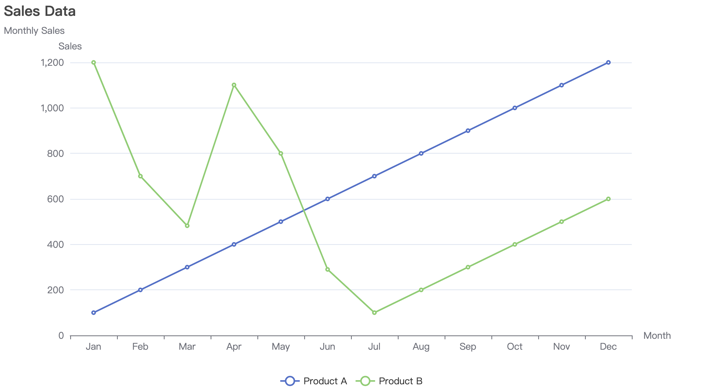
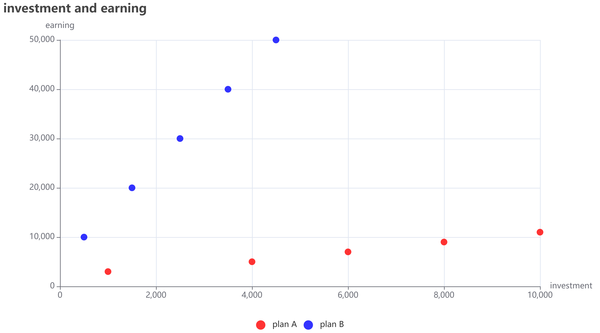
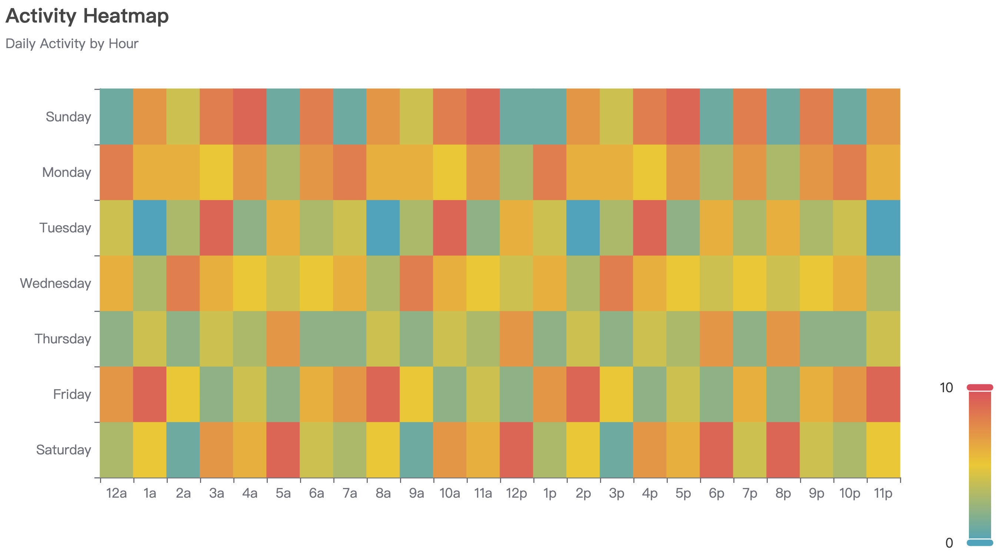
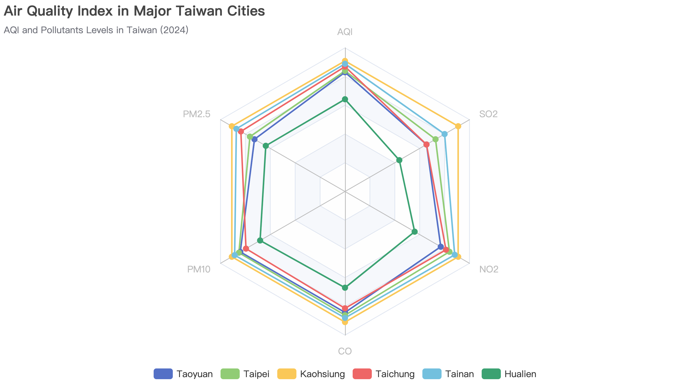
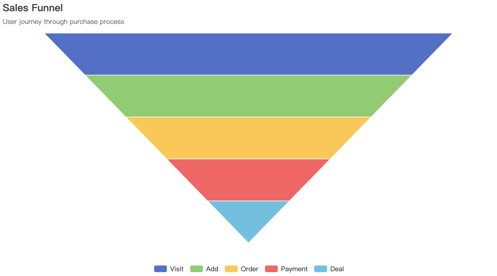

# [ plot ] Package

The `plot` package creates interactive web-based charts using [go-echarts](https://github.com/go-echarts/go-echarts). Charts can be saved as HTML files for web viewing or exported as PNG images.

**PNG export notes:**

- `SavePNG` renders via Chrome/Chromium when available.
- If local rendering fails and `useOnlineServiceOnFail` is `true` (default), it sends the chart to HazelnutParadise's online renderer.
- Disable the online fallback by passing `false` to `SavePNG`.

## Installation

```bash
go get github.com/HazelnutParadise/insyra/plot
```

## Quick Start

```go
package main

import (
    "github.com/HazelnutParadise/insyra"
    "github.com/HazelnutParadise/insyra/plot"
)

func main() {
    // Create data
    sales := insyra.NewDataList(100, 150, 120, 180).SetName("Sales")

    // Create chart configuration
    config := plot.BarChartConfig{
        Title: "Monthly Sales",
        XAxis: []string{"Jan", "Feb", "Mar", "Apr"},
    }

    // Create and save chart
    chart := plot.CreateBarChart(config, sales)
    plot.SaveHTML(chart, "sales.html")

    // Or save as PNG (requires Chrome/Chromium)
    plot.SavePNG(chart, "sales.png")
}
```

## Supported Chart Types

| Chart      | Function                | Use Case                     |
| ---------- | ----------------------- | ---------------------------- |
| Bar        | `CreateBarChart`        | Category comparison          |
| Line       | `CreateLineChart`       | Trends over time             |
| Scatter    | `CreateScatterChart`    | Correlation analysis         |
| Pie        | `CreatePieChart`        | Part-to-whole relationships  |
| HeatMap    | `CreateHeatMap`         | Matrix visualization         |
| Radar      | `CreateRadarChart`      | Multi-dimensional comparison |
| Funnel     | `CreateFunnelChart`     | Stage-based processes        |
| Gauge      | `CreateGaugeChart`      | Single value display         |
| WordCloud  | `CreateWordCloud`       | Text frequency               |
| Sankey     | `CreateSankeyChart`     | Flow visualization           |
| BoxPlot    | `CreateBoxPlot`         | Distribution comparison      |
| K-Line     | `CreateKlineChart`      | Stock data                   |
| ThemeRiver | `CreateThemeRiverChart` | Temporal flow data           |

## Common Types

### Theme

The `Theme` type defines the visual style of the chart.

```go
type Theme string

const (
    ThemeChalk         Theme = "chalk"
    ThemeEssos         Theme = "essos"
    ThemeInfographic   Theme = "infographic"
    ThemeMacarons      Theme = "macarons"
    ThemePurplePassion Theme = "purple-passion"
    ThemeRoma          Theme = "roma"
    ThemeRomantic      Theme = "romantic"
    ThemeShine         Theme = "shine"
    ThemeVintage       Theme = "vintage"
    ThemeWalden        Theme = "walden"
    ThemeWesteros      Theme = "westeros"
    ThemeWonderland    Theme = "wonderland"
)
```

### Position

Used for positioning elements like titles and legends.

```go
type Position string

const (
    PositionTop    Position = "top"
    PositionBottom Position = "bottom"
    PositionLeft   Position = "left"
    PositionRight  Position = "right"
)
```

### LabelPosition

Used for positioning labels on chart elements.

```go
type LabelPosition string

const (
    LabelPositionTop               LabelPosition = "top"
    LabelPositionBottom            LabelPosition = "bottom"
    LabelPositionLeft              LabelPosition = "left"
    LabelPositionRight             LabelPosition = "right"
    LabelPositionInside            LabelPosition = "inside"
    LabelPositionInsideLeft        LabelPosition = "insideLeft"
    LabelPositionInsideRight       LabelPosition = "insideRight"
    LabelPositionInsideTop         LabelPosition = "insideTop"
    LabelPositionInsideBottom      LabelPosition = "insideBottom"
    LabelPositionInsideTopLeft     LabelPosition = "insideTopLeft"
    LabelPositionInsideBottomLeft  LabelPosition = "insideBottomLeft"
    LabelPositionInsideTopRight    LabelPosition = "insideTopRight"
    LabelPositionInsideBottomRight LabelPosition = "insideBottomRight"
)
```

---

## Saving Charts

### Save HTML

```go
func SaveHTML(chart Renderable, path string, animation ...bool) error
```

**Description:** Renders the chart to an HTML file.

**Parameters:**

- `chart`: The chart object. Type: `Renderable`.
- `path`: The file path to save the HTML. Type: `string`.
- `animation`: Optional boolean to enable/disable animation (default: enabled).

**Returns:**

- `error`: Error when the operation fails.

### Save PNG

```go
func SavePNG(chart Renderable, pngPath string, useOnlineServiceOnFail ...bool) error
```

**Description:** Renders the chart to a PNG image. Requires Chrome/Chromium installed or uses an online fallback service.

**Parameters:**

- `chart`: The chart object. Type: `Renderable`.
- `pngPath`: The file path to save the PNG. Type: `string`.
- `useOnlineServiceOnFail`: Optional boolean. If true (default), it tries to use an online rendering service if local rendering fails.

**Returns:**

- `error`: Error when the operation fails.

---

## Chart Types

### 1. Bar Chart


#### Configuration

```go
type BarChartConfig struct {
    Width           string   // Default "900px"
    Height          string   // Default "500px"
    BackgroundColor string   // Default "white"
    Theme           Theme
    Title           string
    Subtitle        string
    TitlePos        Position
    HideLegend      bool
    LegendPos       Position

    XAxis     []string // X-axis labels
    XAxisName string
    YAxisName string

    // Y-axis customization
    YAxisMin         *float64
    YAxisMax         *float64
    YAxisSplitNumber *int
    YAxisFormatter   string   // e.g. "{value}°C"

    Colors     []string
    ShowLabels bool
    LabelPos   LabelPosition
}
```

#### Creation

```go
func CreateBarChart(config BarChartConfig, data ...insyra.IDataList) *charts.Bar
```

**Description:** Use when you need this function.

**Parameters:**

- `config`: Configuration options. Type: `BarChartConfig`.
- `data`: Variadic `insyra.IDataList` values.

**Returns:**

- `*charts.Bar`: Return value.

### 2. Line Chart



#### Configuration

```go
type LineChartConfig struct {
    Width           string
    Height          string
    BackgroundColor string
    Theme           Theme
    Title           string
    Subtitle        string
    TitlePos        Position
    HideLegend      bool
    LegendPos       Position

    XAxis     []string
    XAxisName string

    YAxisName        string
    YAxis            []string // Category labels for Y-axis
    YAxisMin         *float64
    YAxisMax         *float64
    YAxisSplitNumber *int
    YAxisFormatter   string

    Colors     []string
    ShowLabels bool
    LabelPos   string // "top", "bottom", "left", "right"
    Smooth     bool   // Smooth lines
    FillArea   bool   // Fill area under lines
}
```

#### Creation

```go
func CreateLineChart(config LineChartConfig, data ...insyra.IDataList) *charts.Line
```

**Description:** Use when you need this function.

**Parameters:**

- `config`: Configuration options. Type: `LineChartConfig`.
- `data`: Variadic `insyra.IDataList` values.

**Returns:**

- `*charts.Line`: Return value.

### 3. Scatter Chart



#### Configuration

```go
type ScatterPoint struct {
    X float64
    Y float64
}

type ScatterChartConfig struct {
    Width           string
    Height          string
    BackgroundColor string
    Theme           Theme
    Title           string
    Subtitle        string
    TitlePos        Position
    HideLegend      bool
    LegendPos       Position

    XAxisName        string
    XAxisMin         *float64
    XAxisMax         *float64
    XAxisSplitNumber *int
    XAxisFormatter   string

    YAxisName        string
    YAxisMin         *float64
    YAxisMax         *float64
    YAxisSplitNumber *int
    YAxisFormatter   string

    Colors     []string
    ShowLabels bool
    LabelPos   LabelPosition
    SplitLine  bool
    Symbol     []string // e.g. "circle", "rect"
    SymbolSize int
}
```

#### Creation

```go
func CreateScatterChart(config ScatterChartConfig, data map[string][]ScatterPoint) *charts.Scatter
```

**Description:** Use when you need this function.

**Parameters:**

- `config`: Configuration options. Type: `ScatterChartConfig`.
- `data`: Input data values. Type: `map[string][]ScatterPoint`.

**Returns:**

- `*charts.Scatter`: Return value.

### 4. Pie Chart


#### Configuration

```go
type PieItem struct {
    Name  string
    Value float64
}

type PieChartConfig struct {
    Width           string
    Height          string
    BackgroundColor string
    Theme           Theme
    Title           string
    Subtitle        string
    TitlePos        Position
    HideLegend      bool
    LegendPos       Position

    Colors      []string
    ShowLabels  bool
    ShowPercent bool
    LabelPos    LabelPosition
    RoseType    string   // "radius" or "area"
    Radius      []string // e.g. ["40%", "75%"]
    Center      []string // e.g. ["50%", "50%"]
}
```

#### Creation

```go
func CreatePieChart(config PieChartConfig, data ...PieItem) *charts.Pie
```

**Description:** Use when you need this function.

**Parameters:**

- `config`: Configuration options. Type: `PieChartConfig`.
- `data`: Variadic `PieItem` values.

**Returns:**

- `*charts.Pie`: Return value.

### 5. HeatMap



#### Configuration

```go
type HeatMapConfig struct {
    Width           string
    Height          string
    BackgroundColor string
    Theme           Theme
    Title           string
    Subtitle        string
    TitlePos        Position

    XAxis []string
    YAxis []string

    Colors []string
    Min    *float64
    Max    *float64

    UseCalendar  bool
    CalendarOpts *opts.Calendar
}
```

#### Creation

```go
// heapMapAxisValue can be int | string | time.Time
func CreateHeatMap[X heapMapAxisValue, Y heapMapAxisValue](config HeatMapConfig, points ...heatMapPoint[X, Y]) *charts.HeatMap
```

Helper functions:

- `HeatMapPoint(x, y, value)`
- `HeatMapMissingPoint(x, y)`

### 6. Radar Chart



#### Configuration

```go
type RadarChartConfig struct {
    Width           string
    Height          string
    BackgroundColor string
    Theme           Theme
    Title           string
    Subtitle        string
    TitlePos        Position
    HideLegend      bool
    LegendPos       Position

    Indicators []string           // Dimension names
    MaxValues  map[string]float32 // Max value for each dimension
}

type RadarSeries struct {
    Name   string
    Values []float32
    Color  string
}
```

#### Creation

```go
func CreateRadarChart(config RadarChartConfig, series []RadarSeries) *charts.Radar
```

**Description:** Use when you need this function.

**Parameters:**

- `config`: Configuration options. Type: `RadarChartConfig`.
- `series`: Input value for `series`. Type: `[]RadarSeries`.

**Returns:**

- `*charts.Radar`: Return value.

### 7. Funnel Chart



#### Configuration

```go
type FunnelChartConfig struct {
    Width           string
    Height          string
    BackgroundColor string
    Theme           Theme
    Title           string
    Subtitle        string
    TitlePos        Position
    HideLegend      bool
    LegendPos       Position

    ShowLabels bool
    LabelPos   LabelPosition
}
```

#### Creation

```go
func CreateFunnelChart(config FunnelChartConfig, data map[string]float64) *charts.Funnel
```

**Description:** Use when you need this function.

**Parameters:**

- `config`: Configuration options. Type: `FunnelChartConfig`.
- `data`: Input data values. Type: `map[string]float64`.

**Returns:**

- `*charts.Funnel`: Return value.

### 8. Gauge Chart


#### Configuration

```go
type GaugeChartConfig struct {
    Width           string
    Height          string
    BackgroundColor string
    Theme           Theme
    Title           string
    Subtitle        string
    TitlePos        Position
    HideLegend      bool
    LegendPos       Position

    SeriesName string
}
```

#### Creation

```go
func CreateGaugeChart(config GaugeChartConfig, value float64) *charts.Gauge
```

**Description:** Use when you need this function.

**Parameters:**

- `config`: Configuration options. Type: `GaugeChartConfig`.
- `value`: Input value for `value`. Type: `float64`.

**Returns:**

- `*charts.Gauge`: Return value.

### 9. WordCloud


#### Configuration

```go
type WordCloudShape string

const (
    WordCloudShapeCircle    WordCloudShape = "circle"
    WordCloudShapeRect      WordCloudShape = "rect"
    WordCloudShapeRoundRect WordCloudShape = "roundRect"
    WordCloudShapeTriangle  WordCloudShape = "triangle"
    WordCloudShapeDiamond   WordCloudShape = "diamond"
    WordCloudShapePin       WordCloudShape = "pin"
    WordCloudShapeArrow     WordCloudShape = "arrow"
)

type WordCloudConfig struct {
    Width           string
    Height          string
    BackgroundColor string
    Theme           Theme
    Title           string
    Subtitle        string
    TitlePos        Position

    Shape     WordCloudShape
    SizeRange []float32      // e.g. [14, 80]
}
```

#### Creation

```go
func CreateWordCloud(config WordCloudConfig, data insyra.IDataList) *charts.WordCloud
```

**Description:** Use when you need this function.

**Parameters:**

- `config`: Configuration options. Type: `WordCloudConfig`.
- `data`: Input data values. Type: `insyra.IDataList`.

**Returns:**

- `*charts.WordCloud`: Return value.

### 10. Sankey Chart


#### Configuration

```go
type SankeyLink struct {
    Source string  `json:"source"`
    Target string  `json:"target"`
    Value  float32 `json:"value"`
}

type SankeyChartConfig struct {
    Width           string
    Height          string
    BackgroundColor string
    Theme           Theme
    Title           string
    Subtitle        string
    TitlePos        Position

    Nodes      []string
    Curveness  float32
    Color      string
    ShowLabels bool
}
```

#### Creation

```go
func CreateSankeyChart(config SankeyChartConfig, links ...SankeyLink) *charts.Sankey
```

**Description:** Use when you need this function.

**Parameters:**

- `config`: Configuration options. Type: `SankeyChartConfig`.
- `links`: Variadic `SankeyLink` values.

**Returns:**

- `*charts.Sankey`: Return value.

### 11. BoxPlot


#### Configuration

```go
type BoxPlotSeries struct {
    Name  string
    Data  []insyra.IDataList
    Color string
    Fill  bool
}

type BoxPlotConfig struct {
    Width           string
    Height          string
    BackgroundColor string
    Theme           Theme
    Title           string
    Subtitle        string
    TitlePos        Position
    HideLegend      bool
    LegendPos       Position

    XAxis     []string
    XAxisName string
    YAxisName string
    YAxisMin         *float64
    YAxisMax         *float64
    YAxisSplitNumber *int
    YAxisFormatter   string
}
```

#### Creation

```go
func CreateBoxPlot(config BoxPlotConfig, series ...BoxPlotSeries) *charts.BoxPlot
```

**Description:** Use when you need this function.

**Parameters:**

- `config`: Configuration options. Type: `BoxPlotConfig`.
- `series`: Variadic `BoxPlotSeries` values.

**Returns:**

- `*charts.BoxPlot`: Return value.

### 12. K-Line Chart


#### Configuration

```go
type KlinePoint struct {
    Date  time.Time `json:"date"`
    Open  float64   `json:"open"`
    High  float64   `json:"high"`
    Low   float64   `json:"low"`
    Close float64   `json:"close"`
}

type KlineChartConfig struct {
    Width           string
    Height          string
    BackgroundColor string
    Theme           Theme
    Title           string
    Subtitle        string
    TitlePos        Position

    DateFormat string // e.g. "YYYY-MM-DD"
    DataZoom   bool
}
```

#### Creation

```go
func CreateKlineChart(config KlineChartConfig, klinePoints ...KlinePoint) *charts.Kline
```

**Description:** Use when you need this function.

**Parameters:**

- `config`: Configuration options. Type: `KlineChartConfig`.
- `klinePoints`: Variadic `KlinePoint` values.

**Returns:**

- `*charts.Kline`: Return value.

### 13. ThemeRiver Chart


#### Configuration

```go
type ThemeRiverAxisType string

const (
    ThemeRiverAxisTypeTime ThemeRiverAxisType = "time"
)

type ThemeRiverData struct {
    Date  string  // format: "yyyy/MM/dd"
    Value float64
    Name  string
}

type ThemeRiverChartConfig struct {
    Width           string
    Height          string
    BackgroundColor string
    Theme           Theme
    Title           string
    Subtitle        string
    TitlePos        Position
    HideLegend      bool
    LegendPos       Position

    AxisType ThemeRiverAxisType
    AxisData []string
    AxisMin  *float64
    AxisMax  *float64
}
```

#### Creation

```go
func CreateThemeRiverChart(config ThemeRiverChartConfig, data ...ThemeRiverData) *charts.ThemeRiver
```

**Description:** Use when you need this function.

**Parameters:**

- `config`: Configuration options. Type: `ThemeRiverChartConfig`.
- `data`: Variadic `ThemeRiverData` values.

**Returns:**

- `*charts.ThemeRiver`: Return value.
